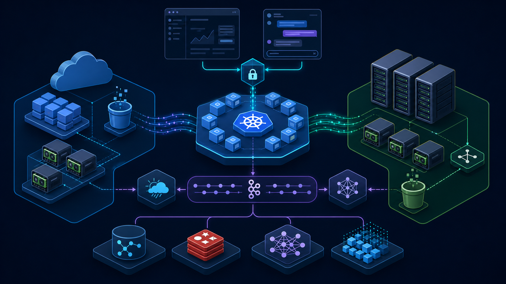
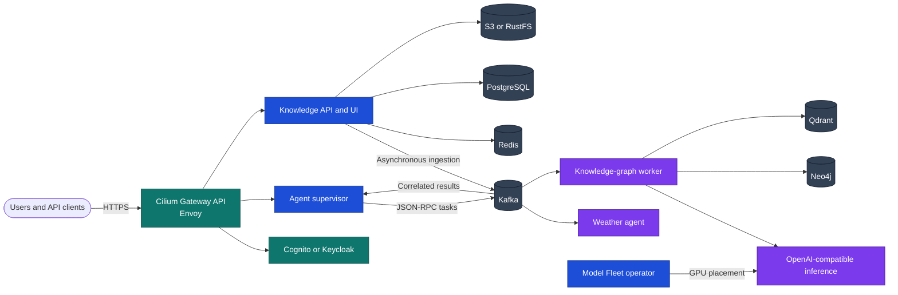

# Agentic Kubernetes Platform

An Apache-2.0 reference platform for event-driven agents, GPU inference, and
training on either AWS EKS or Proxmox-hosted K3s. It uses the same application
contract on both targets and swaps only infrastructure adapters:



_Conceptual illustration; see the verification guide for reproducible evidence._

| Capability | AWS | Bare metal |
|---|---|---|
| Kubernetes | EKS | HA K3s VMs on Proxmox |
| Networking | Cilium CNI, policy, Envoy, Gateway API, NLB | Cilium CNI, policy, Envoy, Gateway API, MetalLB |
| Durable objects | S3 | RustFS (S3-compatible) |
| Fast model cache | EBS/local NVMe PVC hydrated in parallel | local NVMe/PVC hydrated in parallel |
| GPU capacity | autoscaling NVIDIA node group | mapped local NVIDIA PCI devices |

## Included

- Separate weather and knowledge-graph agent packages.
- Kafka-only task and result communication using JSON-RPC 2.0.
- Registry discovery, supervisor routing, KEDA scaling, MLflow hooks, Prometheus,
  Redis response caching, PostgreSQL workflow state, Qdrant vector search, and
  Neo4j graph storage.
- A JWT-capable knowledge API and interactive 2D/3D graph explorer.
- A complete JWST PDF ingestion example that stores the source in S3/RustFS and
  performs expensive extraction in a scale-to-zero worker.
- Multi-stage non-root slim service image, parallel object-store loader, vLLM
  inference image, and configurable PyTorch/Transformers LoRA training image.
- Terraform for EKS/S3/ECR and Proxmox/K3s/GPU passthrough, plus Helm and GitOps.
- Optional Model Fleet integration for GPU-fit inference/training and an
  allowlisted Slack operations and agent-routing surface.

## Architecture



### Documentation

- **Understand the system:** [full architecture](docs/ARCHITECTURE.md) and
  [agent internals](docs/AGENT_ARCHITECTURE.md).
- **Identity and data:** [authentication](docs/AUTHENTICATION.md),
  [graph ontologies](docs/ONTOLOGIES.md), and [data services](docs/DATA_SERVICES.md).
- **Extend the platform:** [bring your own model or agent](docs/BRING_YOUR_OWN.md),
  [add an agent](docs/ADDING_AGENTS.md), and
  [integrate Model Fleet](docs/MODEL_FLEET_INTEGRATION.md).
- **Deploy:** [AWS EKS](docs/AWS.md), [Proxmox/K3s](docs/PROXMOX.md), or the
  [local kind environment](infrastructure/kind/README.md).
- **Publish responsibly:** [publishing and evidence](docs/PUBLISHING.md) and the
  [verification guide](docs/VERIFICATION.md).

## Local quick start

```bash
make install
make test
docker compose up --build

# Route a weather task. Results are written to results.weather.
curl -s http://localhost:8002/v1/tasks -H 'content-type: application/json' \
  -d '{"jsonrpc":"2.0","id":"demo-1","method":"weather.current","params":{"location":"London"}}'

# Open the graph API/UI (local compose disables auth only for development).
open http://localhost:8200/
```

Start the costly graph worker only after providing an OpenAI-compatible model:

```bash
OPENAI_BASE_URL=http://host.docker.internal:8000 \
OPENAI_MODEL=/models/model docker compose --profile knowledge up --build
./examples/knowledge/jwst-ingest.sh
```

Local credentials in `docker-compose.yaml` are intentionally development-only.
Kubernetes manifests require pre-created Secrets and never contain credentials.

For a disposable Kubernetes integration environment with Cilium, Kafka,
RustFS, all data services, and operator-managed Keycloak, start Docker and run
`make kind-up`. It intentionally has no GPU or LLM; see the
[kind guide](infrastructure/kind/README.md).

## Verification

```bash
make lint test
make helm
make terraform
docker compose config --quiet
```

No cloud or cluster resources are created until you explicitly run
`terraform apply`, bootstrap scripts, or `helm install`.
