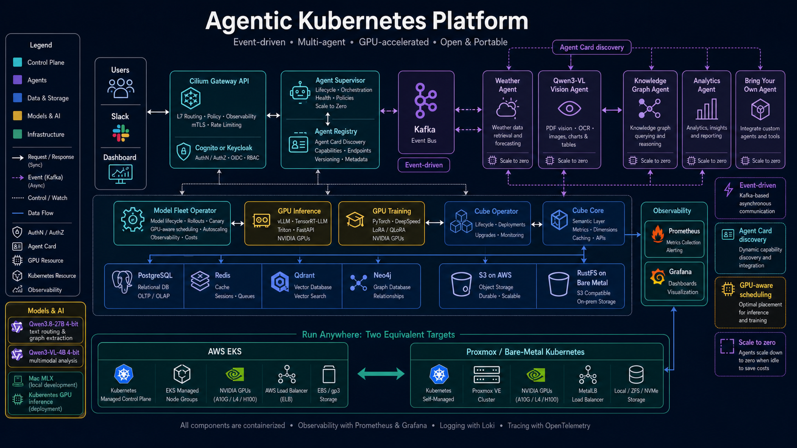
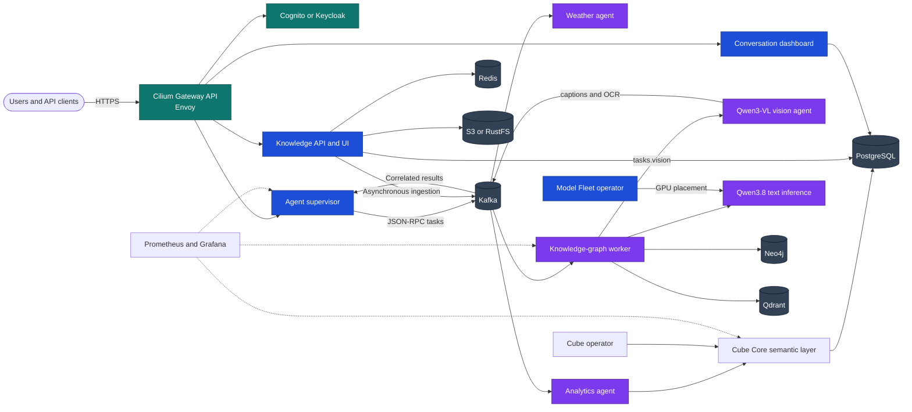

# Agentic Kubernetes Platform

An Apache-2.0 reference platform for event-driven agents, GPU inference, and
training on either AWS EKS or Proxmox-hosted K3s. It uses the same application
contract on both targets and swaps only infrastructure adapters:



_Conceptual illustration; see the verification guide for reproducible evidence._

| Capability | AWS | Bare metal |
|---|---|---|
| Kubernetes | EKS | HA K3s VMs on Proxmox |
| Networking | Cilium CNI, policy, Envoy, Gateway API, NLB | Cilium CNI, policy, Envoy, Gateway API, MetalLB |
| Durable objects | S3 | RustFS (S3-compatible) |
| Fast model cache | EBS/local NVMe PVC hydrated in parallel | local NVMe/PVC hydrated in parallel |
| GPU capacity | autoscaling NVIDIA node group | mapped local NVIDIA PCI devices |

## Included

- Separate weather, knowledge-graph, and Cube-backed analytics agent packages.
- Kafka-only task and result communication using JSON-RPC 2.0.
- Registry discovery, supervisor routing, KEDA scaling, MLflow hooks, Prometheus,
  Redis response caching, PostgreSQL workflow state, Qdrant vector search, and
  Neo4j graph storage.
- JWT-capable conversation and knowledge APIs, a minimal agent dashboard with
  read-only thread sharing, and an interactive 2D/3D graph explorer.
- A complete JWST PDF ingestion example that stores the source in S3/RustFS and
  performs expensive extraction in a scale-to-zero worker.
- Multi-stage non-root slim service image, parallel object-store loader, vLLM
  inference image, and configurable PyTorch/Transformers LoRA training image.
- Terraform for EKS/S3/ECR and Proxmox/K3s/GPU passthrough, plus Helm and GitOps.
- Optional Model Fleet integration for GPU-fit inference/training and an
  allowlisted Slack operations and agent-routing surface.

## Architecture



### Documentation

- **Understand the system:** [full architecture](docs/ARCHITECTURE.md) and
  [agent internals](docs/AGENT_ARCHITECTURE.md).
- **Identity and data:** [authentication](docs/AUTHENTICATION.md),
  [conversation dashboard](docs/DASHBOARD.md), [graph ontologies](docs/ONTOLOGIES.md),
  [knowledge agent and explorer](agents/knowledge-graph/README.md), and
  [data services](docs/DATA_SERVICES.md).
- **Analytics:** [Cube operator and agent-to-agent BI](docs/CUBE_ANALYTICS.md).
- **Extend the platform:** [bring your own model or agent](docs/BRING_YOUR_OWN.md),
  [add an agent](docs/ADDING_AGENTS.md), and
  [integrate Model Fleet](docs/MODEL_FLEET_INTEGRATION.md).
- **Deploy:** [AWS EKS](docs/AWS.md), [Proxmox/K3s](docs/PROXMOX.md), or the
  [local kind environment](infrastructure/kind/README.md).
- **Publish responsibly:** [publishing and evidence](docs/PUBLISHING.md) and the
  [verification guide](docs/VERIFICATION.md).

## Local quick start

```bash
make install
make test
docker compose up --build

# Route a weather task. Results are written to results.weather.
curl -s http://localhost:8002/v1/tasks -H 'content-type: application/json' \
  -d '{"jsonrpc":"2.0","id":"demo-1","method":"weather.current","params":{"location":"London"}}'

# Open the graph API/UI (local compose disables auth only for development).
open http://localhost:8200/

# Open persisted agent conversations and read-only sharing.
open http://localhost:8002/dashboard
```

Start the costly graph worker only after providing an OpenAI-compatible model:

```bash
OPENAI_BASE_URL=http://host.docker.internal:8000 \
OPENAI_MODEL=/models/model docker compose --profile knowledge up --build
./examples/knowledge/jwst-ingest.sh
```

The graph explorer shows ingestion state and knowledge-base metrics, filters
the combined 2D/3D graph by one or several source documents, and exposes fused
Neo4j + Qdrant retrieval for future agents. Redis invalidates stale tenant
views and warms the common document, metrics, and graph views after ingestion.
See [institutional knowledge and ontologies](docs/ONTOLOGIES.md).

Local credentials in `docker-compose.yaml` are intentionally development-only.
Kubernetes manifests require pre-created Secrets and never contain credentials.

### Full local Kubernetes installation with kind

Use this path to test the Kubernetes topology rather than only the Compose
services. It installs Cilium/Envoy and Gateway API, Redpanda's Kafka-compatible
broker, KEDA, RustFS, PostgreSQL, Qdrant, Neo4j, Redis, the platform services,
and operator-managed Keycloak in a disposable kind cluster.

Prerequisites are Docker Desktop, Terraform, kind, kubectl, and Helm. On macOS:

```bash
brew install kind kubectl helm

# Confirm every prerequisite before Terraform invokes local-exec provisioners.
for command in docker terraform kind kubectl helm; do
  command -v "$command" >/dev/null || echo "missing: $command"
done
docker info  # Must succeed; unpause Docker Desktop if it does not.
```

Create and review the local configuration, then install:

```bash
cd infrastructure/kind
cp terraform.tfvars.example terraform.tfvars
terraform init
terraform plan -out=tfplan
terraform apply tfplan
```

Terraform builds the runtime image, creates `kind-agentic-platform`, installs
the required operators and charts, and waits for the Cilium Gateway to become
programmed. A failed prerequisite check is safe to correct and rerun with
`terraform apply`; Terraform replaces the failed provisioner resource.

Verify the installation:

```bash
kubectl --context kind-agentic-platform get nodes
kubectl --context kind-agentic-platform get pods -A
kubectl --context kind-agentic-platform -n agentic-platform \
  get gateway,httproute,service,scaledobject

curl --fail http://127.0.0.1:8080/knowledge/health
open http://127.0.0.1:8080/knowledge/
open http://127.0.0.1:8080/dashboard
```

Install the sibling open-source Cube operator and Cube-backed analytics agent
into the running Kind cluster, then execute a Kafka-routed BI task:

```bash
./scripts/install-cube-analytics.sh
./scripts/verify-cube-analytics.sh
./scripts/install-monitoring.sh

# In the dashboard, choose analytics.usage or analytics.errors.
open http://127.0.0.1:8080/dashboard
open http://127.0.0.1:8080/grafana/
open http://127.0.0.1:8080/grafana/d/agentic-platform-cube/agentic-platform-and-cube
```

The installer supports both amd64 and Apple Silicon Kind nodes and uses
digest-pinned Cube/Cube Store images. See [Cube analytics](docs/CUBE_ANALYTICS.md).
Use `analytics.usage` or `analytics.errors` in `/dashboard`; Cube Core remains
private and has no production-mode Playground.

## Apple Silicon MLX local GPU bridge

Metal is available to native macOS processes, not Linux containers inside Kind.
Run two host-native OpenAI-compatible MLX servers: Qwen3.8 handles routing and
text graph extraction on port 8081; the independently scalable Qwen3-VL agent
uses the vision server on port 8082 for PDF pages, OCR, tables, and diagrams.
Kind reaches both through `host.docker.internal`.

Check disk first. Qwen3.8 weights are about 16.1 GB and the vision model about
3.1 GB; downloads and caches need additional headroom:

```bash
df -h .
du -sh ~/.cache/huggingface ~/.cache/mlx 2>/dev/null || true
python3.12 -m venv .venv-mlx
.venv-mlx/bin/pip install -U mlx-lm mlx-vlm

# Terminal 1: text routing and ontology extraction (port 8081).
MLX_SERVER=.venv-mlx/bin/mlx_lm.server bash scripts/run-mlx-gateway.sh

# Terminal 2: multimodal vision agent (port 8082).
bash scripts/run-mlx-vision.sh

# Verify both OpenAI-compatible model catalogs.
curl --fail http://127.0.0.1:8081/v1/models
curl --fail http://127.0.0.1:8082/v1/models
```

A 48 GB unified-memory Mac can run both quantized models, but active context,
KV cache, Python, Docker, and the desktop still need headroom. Stop one model or
reduce context if memory pressure rises. These servers are development bridges:
bind them to loopback, never expose them publicly, and use vLLM/Model Fleet on
Kubernetes GPU nodes for production. In the dashboard choose **Auto · LLM
router** or a named skill while the text model is stopped.

Remove the complete local environment when finished:

```bash
terraform destroy
```

The shorter equivalents from the repository root are `make kind-up`,
`make kind-status`, and `make kind-down`. See the
[kind guide](infrastructure/kind/README.md) for configuration details.

## Verification

```bash
make lint test
make helm
make terraform
docker compose config --quiet
```

No cloud or cluster resources are created until you explicitly run
`terraform apply`, bootstrap scripts, or `helm install`.
