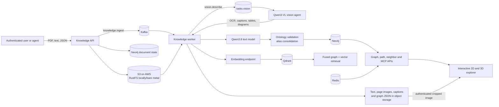
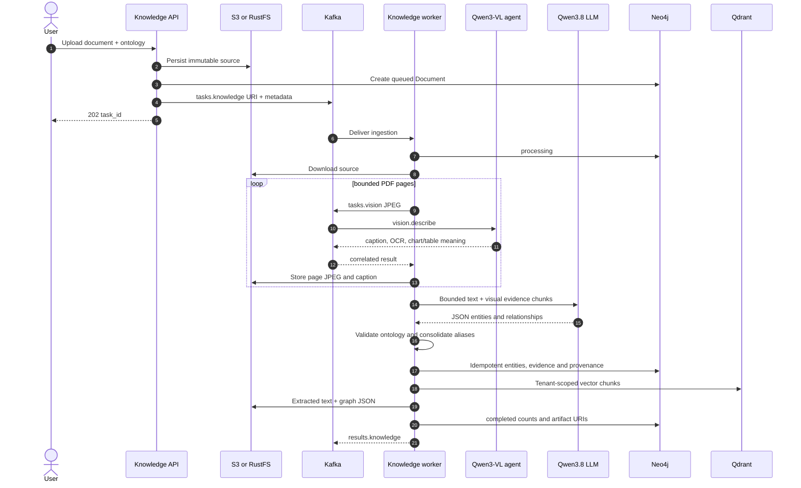
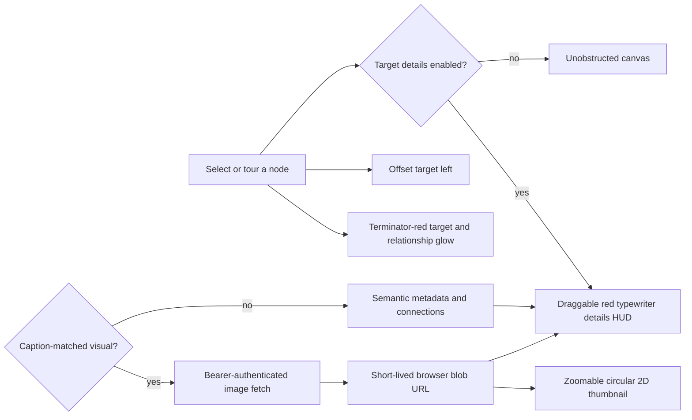
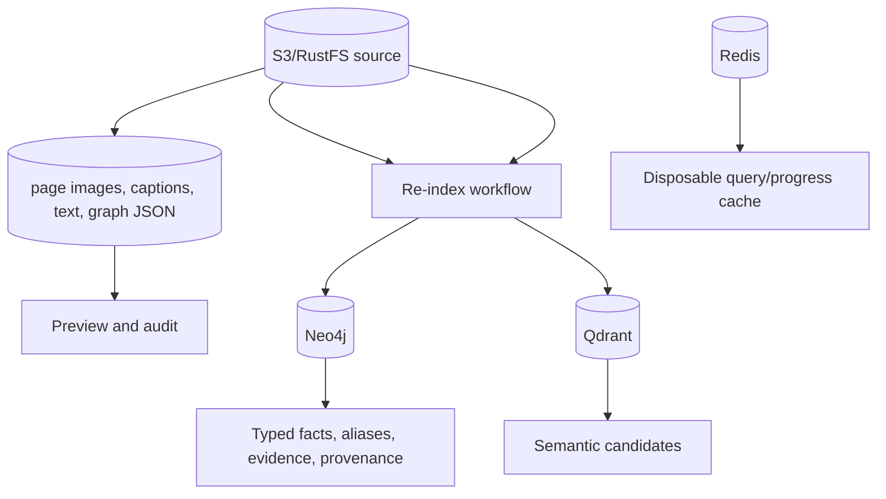

# Knowledge Graph Agent

The knowledge subsystem turns PDF, text, and JSON documents into reusable,
tenant-isolated institutional knowledge. A cheap API serves uploads and queries;
Kafka workers perform expensive text and vision extraction asynchronously.

## Architecture



The services are deliberately separate:

- **`knowledge-api`** handles OIDC, uploads, document state, previews, graph
  queries, metrics, MCP, and the browser explorer.
- **`knowledge-worker`** consumes `tasks.knowledge`, renders PDFs, coordinates
  visual analysis, extracts typed entities, stores artifacts, indexes vectors,
  and publishes correlated `results.knowledge` messages.
- **`vision`** consumes `tasks.vision` and invokes Qwen3-VL independently, so
  multimodal capacity can scale separately from text extraction.

## End-to-end ingestion



Failures remain visible on the `Document` record. Redis progress/cache outages
cannot turn an otherwise completed durable ingestion into a failure. Replays are
safe because document IDs and graph identities are idempotency keys.

## Explorer features

- Combined graph or one/multiple selected source documents.
- Ontology and entity-type filters.
- **ForceAtlas knowledge map:** force-directed 2D/3D clustering keeps real edges
  visible and lets highly connected concepts form natural branches. Initial
  Brownian-style dispersion visibly anneals into order; dragging a node reheats
  the topology so both views settle again around the connection-weighted shape.
  The 2D view adds restrained demoscene-style light pulses along real edges.
- **Selected neighborhood:** a compact two-hop view redraws around the selected
  entity for focused investigation.
- **Graph movie:** connection-ordered traversal spotlights each entity, its
  immediate neighbors and relationships, presents its metadata and pictures,
  and moves the 2D viewport or 3D camera automatically. Pause and resume retain
  the current scene.
- **Fractal projections:** spacious deterministic Buddhabrot, dragon-curve,
  Julia-nebula, Sierpiński-tetrahedron, and Hausdorff Cantor-dust layouts work
  in 2D, 3D, and animated 4D projection. The Cantor dust reports its calculated
  Hausdorff dimension; tesseract mode rotates four-dimensional coordinates and
  perspective-projects them into the WebGL scene.
  Fractal cinema ends with an animated monochrome-green Conway Life matrix;
  density clouds and curve guides keep the forms recognizable without changing
  the underlying graph data. ASCII voxel glyphs provide a legible overview,
  labels reveal progressively while zooming, and translucent object tiles
  preserve depth and target visibility. Semantic links remain intact but render
  as very thin dash-dot paths with moving particles to avoid hiding the forms.
  Complete luminous mathematical scaffolds are rendered independently of graph
  size, so even a small dataset sits inside an unmistakable labeled silhouette.
- Optional complete graph and low-value reference-node visibility.
- 2D vis-network and 3D WebGL layouts with ontology colors, directed relations,
  degree-aware sizing, evidence panels, and shortest-path tracing.
- Authenticated source preview, extracted text/JSON, and page-image previews.
- The selected target shifts left to leave room for an optional persistent
  details HUD. The HUD updates for each target, can be dragged anywhere on the
  canvas, never exposes renderer coordinates, and types semantic data with a
  red scanning target-lock presentation.
- Entities with related visual evidence have a gold glow and picture count in
  both renderers. The 2D renderer places protected thumbnails directly inside
  nodes so they remain visible while zooming; selection also shows only
  caption-matched pictures in the details HUD.
- Explicit `Category · <type>` hubs connect every entity with `classified_as`;
  this organizes otherwise isolated discoveries without inventing factual links.



Open `http://127.0.0.1:8080/knowledge/` in Kind. Browser image requests are
fetched with the current bearer token and converted to short-lived blob URLs;
protected visual endpoints are not made public merely to support `` tags.
Near-full-page backgrounds and text-only pages are excluded during extraction.

## REST API

All `/v1` and `/mcp` endpoints require a valid configured OIDC token. The tenant
always comes from the signed `sub` claim, never request data.

| Method | Path | Purpose |
|---|---|---|
| `GET` | `/.well-known/agent.json` | Agent Card and supported skills |
| `POST` | `/v1/knowledge/documents` | Queue supplied text or an S3 URI |
| `POST` | `/v1/knowledge/documents/upload` | Store and queue PDF/text/JSON |
| `GET` | `/v1/knowledge/documents` | List sources and durable statuses |
| `GET` | `/v1/knowledge/progress/{task_id}` | Server-sent ingestion progress |
| `GET` | `/v1/knowledge/documents/{id}/preview` | Original source stream |
| `GET` | `/v1/knowledge/documents/{id}/extracted` | Extracted graph JSON and text |
| `GET` | `/v1/knowledge/documents/{id}/visuals` | Extracted-picture captions and protected image URLs |
| `GET` | `/v1/knowledge/documents/{id}/visuals/{page}/image` | Largest meaningful picture extracted from a page |
| `GET` | `/v1/knowledge/entity/{name}/visuals` | Pictures explicitly linked to an entity by vision evidence |
| `GET` | `/v1/knowledge/stats` | Documents, entities, edges, vectors and visuals |
| `GET` | `/v1/knowledge/ontologies` | Available ontology summaries |
| `GET` | `/v1/knowledge/ontologies/{id}` | Full versioned ontology |
| `GET` | `/v1/knowledge/graph` | Bounded graph; source/type/center filters |
| `GET` | `/v1/knowledge/search` | Name search plus immediate relations |
| `GET` | `/v1/knowledge/neighbors/{name}` | One-to-three-hop traversal |
| `GET` | `/v1/knowledge/path` | Shortest path up to eight hops |
| `GET` | `/v1/knowledge/semantic-search` | Qdrant retrieval |
| `GET` | `/v1/knowledge/fused-search` | Neo4j and Qdrant results together |
| `GET` | `/mcp/tools` | Constrained MCP tool schemas |
| `POST` | `/mcp/call` | Invoke an allowlisted graph/vector tool |
| `GET` | `/health`, `/metrics` | Health and Prometheus telemetry |

Kind uses `local-hash-v1`, a deterministic 384-dimensional lexical embedding,
so Qdrant indexing works without downloading another model. Production deployments
should set `EMBEDDING_BASE_URL` and `EMBEDDING_MODEL` to an OpenAI-compatible
embedding service for semantic quality. Existing documents are not retroactively
indexed when embedding is enabled; re-ingest them to create vector chunks.

### Upload and inspect

```bash
export TOKEN='replace-with-oidc-token'
curl -sS http://127.0.0.1:8080/v1/knowledge/documents/upload \
  -H "Authorization: Bearer $TOKEN" \
  -F title='Roman Space Telescope' -F ontology=astronomy \
  -F file=@'/path/to/roman.pdf'

curl -sS -H "Authorization: Bearer $TOKEN" \
  'http://127.0.0.1:8080/v1/knowledge/documents?ontology=astronomy'
curl -sS -H "Authorization: Bearer $TOKEN" \
  'http://127.0.0.1:8080/v1/knowledge/graph?ontology=astronomy&center=Nancy%20Grace%20Roman%20Space%20Telescope&depth=2'
```

### Fused retrieval

```bash
curl -sS -H "Authorization: Bearer $TOKEN" \
  'http://127.0.0.1:8080/v1/knowledge/fused-search?q=wide-field%20survey&ontology=astronomy&document_id=DOC_ID'
```

Graph retrieval works without embeddings. Semantic and fused vector results
require `EMBEDDING_BASE_URL` and `EMBEDDING_MODEL`; Qdrant alone cannot create
embeddings.

### MCP

The API exposes `graph.search`, `graph.visualize`, `graph.neighbors`,
`graph.path`, `graph.ontology`, `vector.search`, and
`knowledge.fused-search`. It intentionally does not expose arbitrary Cypher or
SQL.

```bash
curl -sS http://127.0.0.1:8080/mcp/call \
  -H "Authorization: Bearer $TOKEN" -H 'Content-Type: application/json' \
  -d '{"name":"graph.path","arguments":{"ontology":"astronomy","source":"JWST","target":"Nancy Grace Roman Space Telescope"}}'
```

## Data ownership and safety



S3/RustFS is the durable source. Neo4j and Qdrant are derived indexes and must
retain tenant, ontology, document ID, model version, and source provenance.
Redis is disposable. Canonical entities retain aliases and existing Neo4j
relationships are rewired when an expanded name is confidently identified
(for example, `Roman Space Telescope` → `Nancy Grace Roman Space Telescope`).
Ambiguous short names are not merged automatically.

## Local models and operations

On Apple Silicon, run Qwen3.8 and Qwen3-VL natively with MLX so Metal remains
available while the agents run inside Kind. Follow the root
[README](../../README.md#apple-silicon-mlx-local-gpu-bridge) for installation,
disk/memory checks, two-server startup, and verification.

```bash
kubectl --context kind-agentic-platform -n agentic-platform \
  logs -f deployment/platform-agentic-platform-knowledge-worker
kubectl --context kind-agentic-platform -n messaging exec deployment/kafka -- \
  rpk group describe knowledge-agent -X brokers=localhost:9092
```

The PDF page count and extraction chunk count are bounded by settings. Increase
them only with measured model context, object-storage, Kafka message, latency,
and GPU-memory budgets. See [ontologies](../../docs/ONTOLOGIES.md),
[architecture](../../docs/ARCHITECTURE.md), and
[verification](../../docs/VERIFICATION.md).
