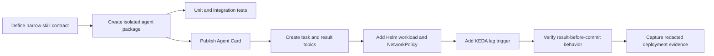

# Adding agents and specialist models

Each agent owns one directory:



```text
agents/my-agent/
├── Dockerfile
├── README.md
├── src/my_agent/
│   ├── __init__.py
│   ├── app.py
│   └── domain.py
└── tests/
```

Implement an agent card, `/health`, `/.well-known/agent.json`, and `/metrics`.
At startup register the card, consume `tasks.my-agent`, and publish a JSON-RPC
result to `results.my-agent`. Do not add an HTTP processing shortcut.

```python
async def handle(payload: dict) -> dict:
    request = JsonRpcRequest.model_validate(payload)
    result = await domain_tool(**request.params)
    return JsonRpcResponse(id=request.id, result=result).model_dump(mode="json")
```

Add the service to Helm values and a KEDA Kafka trigger. Use enough Kafka
partitions for desired concurrency. One worker processes one message at a time;
horizontal replicas provide concurrency without unsafe offset handling.

For a model-backed specialist:

1. Upload an immutable model prefix to S3/RustFS.
2. Hydrate a PVC with the `model-store` init container.
3. Request a GPU count and memory class that fit the model.
4. Serve it through the OpenAI-compatible inference image internally.
5. Point the agent's model URL at that Service; do not expose model ports publicly.
6. Add timeouts, idempotency, metrics, MLflow traces, and tests.

Training is a Kubernetes Job. The supplied image supports JSONL causal-LM data
and LoRA parameters through environment variables. Use a unique output prefix,
upload artifacts to the durable store, and register model metadata only after
the upload succeeds.
