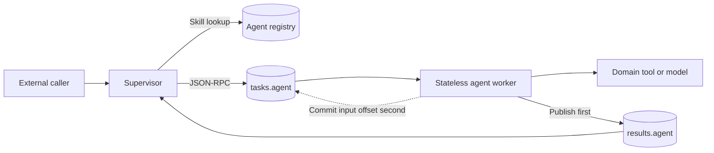
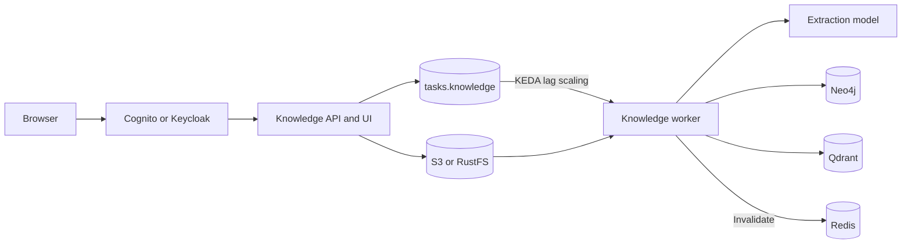
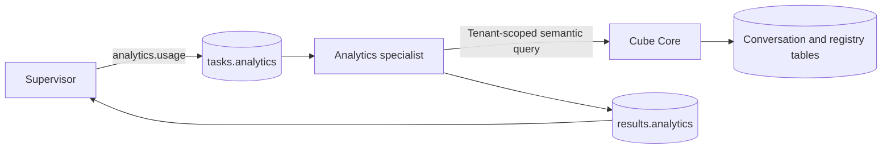

# Specialist agent architecture

Each specialist owns a directory under `agents/`, a versioned Agent Card, one
Kafka task topic, one result topic, domain code, a container, and focused tests.
The shared runtime supplies JSON-RPC validation, at-least-once consumption,
manual offset commits, Redis caching, metrics, and optional MLflow traces. It
does not contain specialist logic.



## Wire and failure contract

A task is JSON-RPC 2.0. The request ID is the Kafka correlation and idempotency
key. A worker publishes the result before committing its input offset. Delivery
is therefore at least once: handlers must make external writes idempotent by
request or document ID. Producer idempotence protects producer retries but does
not make Neo4j, an HTTP API, and Kafka one transaction.

```json
{"jsonrpc":"2.0","id":"weather-1","method":"weather.current","params":{"location":"London"}}
```

Model Fleet uses the standard `tasks.execute` Agent Card envelope. The runtime
normalizes that envelope into the same specialist method, so both supervisors
can publish to the same worker without a second protocol implementation.

## Weather agent

The weather showcase is deliberately model-free. `weather.current` and
`weather.forecast` resolve a location through Open-Meteo, cache repeated reads
in Redis, and return source data with units and timezone. It demonstrates the
minimum production shape: discovery, strict task methods, timeout/error mapping,
cache, metrics, trace hook, and Kafka-only processing.

Examples:

```text
/fleet run weather.current "weather in London"
/fleet run weather.forecast "forecast for Reykjavík"
```

The Slack command reaches the authenticated Model Fleet supervisor, which
selects the exact registered skill and writes `tasks.weather`; Slack never gets
weather-provider or Kafka credentials.

## Knowledge-graph agent

This agent separates a continuously available API/UI from an expensive worker:



The API authenticates users, derives a tenant from the JWT subject, accepts PDF,
text, or JSON, stores the original object, and queues only a durable URI. The
worker extracts bounded chunks through an OpenAI-compatible endpoint, normalizes
the response against `core@1.0.0` or `astronomy@1.0.0`, and upserts tenant- and
ontology-scoped entities and evidence-bearing relationships. Query APIs and MCP
tools expose search, neighbors, shortest path, and ontology inspection. The UI
renders the same API in 2D or 3D.

The graph agent is not registered for Slack by default. Its document and query
operations use Cognito/Keycloak subjects as tenant boundaries, and a Slack user
ID is not interchangeable with that identity. An installation can add a trusted
identity-mapping service before registering graph skills; bypassing tenant
identity is not an acceptable integration shortcut.

## Cube analytics agent



This specialist exposes bounded BI skills, not arbitrary SQL. It returns rows
and the exact Cube query while preserving the normal correlation, idempotency,
caching, metrics, and persistence contracts. See
[Cube analytics](CUBE_ANALYTICS.md).

## Adding a specialist

Use [the implementation checklist](ADDING_AGENTS.md). A useful specialist has a
narrow skill contract, deterministic validation, bounded retries/timeouts,
idempotent side effects, and independent scaling. Put model serving behind an
internal OpenAI-compatible Service and let Model Fleet select GPU fit and own
inference/training resources. Do not embed Kubernetes or cloud credentials in
an agent.
