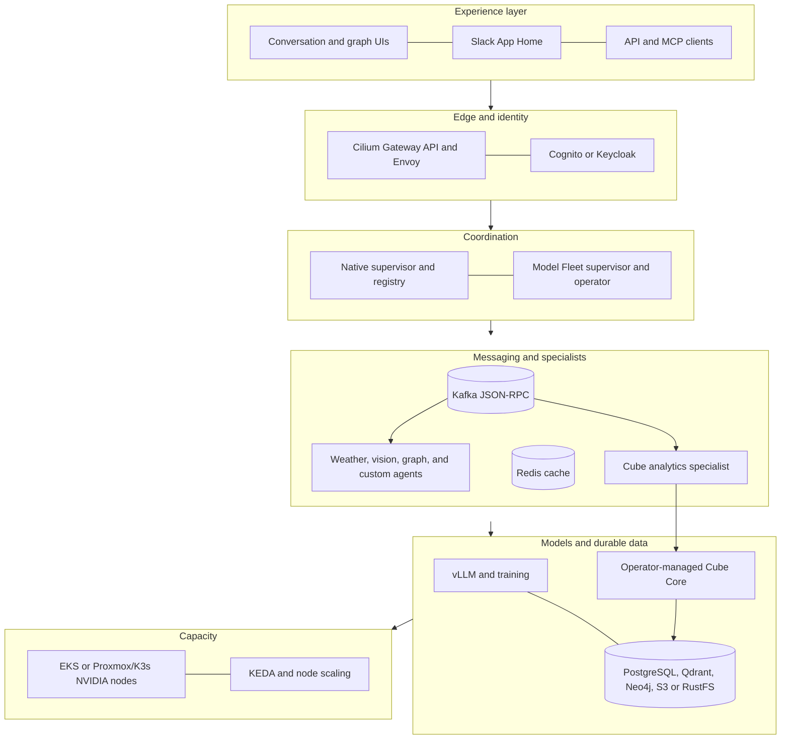
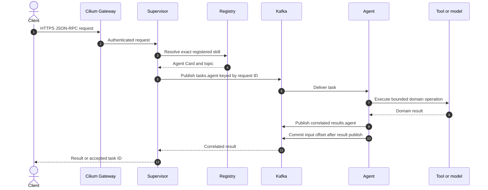
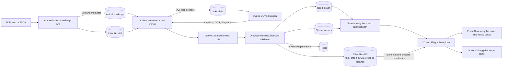

# Architecture

## Design rules

1. Agents are stateless workers. Durable state belongs in Kafka, object storage,
   Neo4j, MLflow, or another explicit backing service.
2. Inter-agent work never uses direct HTTP. The supervisor resolves a registered
   skill and writes JSON-RPC to that agent's Kafka topic; the agent publishes a
   correlated result topic message before committing the input offset.
3. HTTP is reserved for external ingress, health, metrics, discovery, and
   query/control APIs. Cilium Gateway API is the only public entry point.
4. S3/RustFS is the durable source for models, datasets, documents, and training
   artifacts. PVC or node-local storage is a disposable performance cache.
5. Expensive work is asynchronous and independently scalable.

## Platform layers

The native supervisor is the small, provider-neutral route used by direct API
clients. Model Fleet adds durable AgentRegistration/AgentTask state, Slack, and
inference/training control. Both can route the same cards and Kafka workers; an
adapter normalizes Model Fleet's `tasks.execute` envelope into the specialist's
exact JSON-RPC method. See [Model Fleet integration](MODEL_FLEET_INTEGRATION.md).
The native route can use a fixed OpenAI-compatible BYOM endpoint, but validates
its choice against the registry before Kafka dispatch. See
[Bring your own model or agent](BRING_YOUR_OWN.md).

The conversation dashboard persists prompts before dispatch, correlates
`results.*` messages by JSON-RPC ID, and exposes revocable read-only links. See
[conversation dashboard](DASHBOARD.md).

Cube analytics uses the same task/result contract. The specialist applies the
authenticated tenant filter and sends bounded semantic queries to Cube Core;
the Cube operator reconciles its API, refresh worker, and Cube Store. See
[Cube operator and agent-to-agent BI](CUBE_ANALYTICS.md).

## Request and result path

The worker is at-least-once. A crash after side effects but before the Kafka
commit can replay a request, so handlers must use request/document IDs as
idempotency keys. Kafka producer idempotence prevents duplicate producer retries,
but does not make external APIs transactional.

## Knowledge graph path

The graph API remains cheap and responsive. PDF parsing, up to forty bounded
chunks, model extraction, validation, and graph persistence happen in a separate
worker that KEDA can scale from zero. The uploaded document goes directly to the
durable object store; Kafka carries only its URI and metadata.

Extraction is constrained by a versioned ontology. The built-in core ontology
supports general documents, while the astronomy ontology adds observatories,
instruments, missions, measurements, constraints, and typed relations. See
`ONTOLOGIES.md`.

Why it is useful: a graph preserves named entities, provenance evidence, and
multi-hop relationships that vector similarity alone obscures. Agents can call
`graph.search`, `graph.visualize`, `graph.neighbors`, and `graph.path` MCP tools to explain how two
concepts connect. The JWST example can trace observatory components, instruments,
control systems, catalogs, and viewing constraints.

Extracted PDF pictures are sent through Kafka to the independently scalable
`vision.describe` agent. The extractor skips text-only pages and crops the largest
embedded picture with page/bounding-box provenance. Qwen3-VL captions pictures
and transcribes labels, tables, and chart axes. Page-numbered visual evidence is appended to
the extracted text before ontology extraction and vector indexing, so Neo4j
and Qdrant both retain visual knowledge without coupling the workers by HTTP.

Extraction also consolidates confidently expanded aliases within the same
ontology and type, rewiring existing relationships to the canonical entity
while retaining alias names and provenance. Ambiguous abbreviations remain
separate. Explicit ontology category hubs organize every entity—including
otherwise unlinked discoveries—using provenance-scoped `classified_as` edges.
The explorer uses a force-directed atlas by default and can redraw a two-hop
neighborhood around a selection. Selected targets shift left to preserve canvas
space for an optional draggable details HUD. Protected caption-matched pictures
render inside 2D nodes and remain visible while zooming. Complete-graph mode is
explicit, preventing dense document/category nodes from making focused 2D or 3D
views unreadable.

Qdrant adds semantic candidate retrieval without replacing graph truth. A
hybrid agent can find relevant document chunks by vector similarity, traverse
their typed Neo4j relationships, and cite the versioned S3/RustFS source.
PostgreSQL is reserved for relational workflow and audit metadata. See
[PostgreSQL and Qdrant](DATA_SERVICES.md).

## Storage and fast model loading

The `model-store` image lists an object prefix and downloads files concurrently
with multipart transfers into a PVC or local NVMe cache. Existing same-size files
are retained; new files are atomically renamed from partial downloads. Inference
starts only after the init container succeeds. Training uses the same mechanism
for base models and datasets and uploads output adapters/artifacts afterward.

Object storage does not eliminate network time. The speedup comes from keeping a
warm cache, colocating RustFS with fast bare-metal networking, using concurrent
multipart transfers, and avoiding repeated external model-registry downloads.

## GPU scheduling and scaling

Workloads request `nvidia.com/gpu` and select `gpu-memory-class`. AWS node groups
advertise the same labels for scale-from-zero; Proxmox nodes receive labels based
on their PCI mapping. A model-fleet operator can calculate replica-versus-shard
fit and select a larger memory class before these manifests are created.

KEDA scales agents from Kafka lag. Cluster Autoscaler scales AWS managed node
groups. Bare-metal nodes cannot materialize new physical GPUs: Kubernetes can
schedule across newly joined mapped GPU VMs, but capacity planning remains a
hardware operation.

## Networking

Cilium owns pod networking, kube-proxy replacement, NetworkPolicy, Envoy L7
routing, Gateway API, and Hubble flow visibility. On AWS, the generated Gateway
Service receives an NLB. On bare metal, MetalLB assigns a LAN address to the same
Service. HTTPRoutes expose only `/v1/tasks`, `/knowledge`, `/v1/knowledge`,
`/v1/users`, and `/mcp`; Kafka, Redis, Neo4j, model servers, agents, and object
stores stay private.

Prometheus discovers platform, Kafka, Kubernetes, and Cube targets through
ServiceMonitors. Grafana is the only monitoring UI routed by Cilium, under
`/grafana`; the pre-provisioned dashboard combines agent readiness, Kafka lag,
Cube readiness, CPU, and memory without exposing Prometheus or Cube directly.
Agent-facing governed Cube queries remain in `/dashboard` through
`analytics.usage` and `analytics.errors`; Cube Core runs without a public UI.

The knowledge UI uses OIDC Authorization Code with PKCE. Cognito is provisioned
with AWS Terraform; Keycloak and PostgreSQL run in the bare-metal chart and its
realm/client are configured by a separate Terraform root. The API validates the
ID-token issuer, audience, expiry, and JWKS signature before deriving the tenant
from `sub`. See [Authentication](AUTHENTICATION.md).

## Scaling another specialist

Create a package under `agents/`, publish a card and dedicated task/result topics,
add partitions, and add one Helm service/KEDA trigger. No supervisor code changes
are needed because routing follows the registered skill. See `ADDING_AGENTS.md`.
