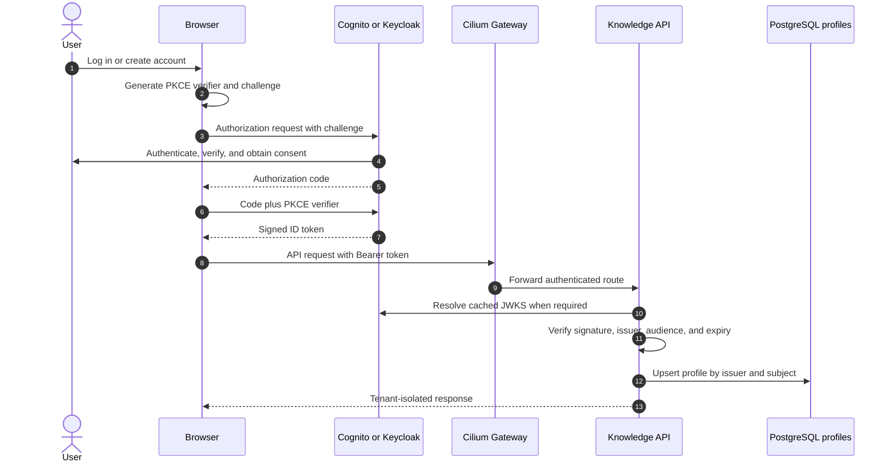

# Authentication

The knowledge explorer is an OIDC public client. It uses Authorization Code
with PKCE, keeps its ID token in browser session storage, and sends that token
to the graph API. The API validates issuer, audience, signature, and expiry from
the provider JWKS. No client secret is shipped to the browser.

Use the exact public explorer URL as the callback. For example, if Cilium serves
the UI at `https://platform.example.com/knowledge`, that exact value belongs in
the Terraform callback list; its origin belongs in the logout/origin list.



## AWS Cognito

Set `cognito_domain_prefix`, `auth_callback_urls`, and `auth_logout_urls` in
`infrastructure/aws/terraform.tfvars`, then apply the reviewed AWS plan. Cognito
creates an email-based user pool, verification flow, optional TOTP, hosted UI,
and public PKCE client.

Cognito is a managed identity provider and cannot use the platform PostgreSQL
instance as its credential database. Passwords, MFA factors, verification, and
account recovery remain in Cognito. After a valid login, the graph API upserts
an application profile keyed by the immutable `(issuer, sub)` pair in
PostgreSQL. It never copies a password or token into that table.

```bash
cd infrastructure/aws
terraform output -json auth
```

Map the output into the `knowledge-runtime-secrets` keys below. The API checks
the Cognito ID-token audience, so `JWT_AUDIENCE` and `OIDC_CLIENT_ID` both use
the output `client_id`.

## Bare-metal Keycloak

Keycloak has two phases because Terraform configures a server that Kubernetes
must start first.

1. Install the official Keycloak Operator version matching the chart's Keycloak
   image into the platform namespace.
2. Create `keycloak-secrets` with `database-username` and `database-password`,
   plus `keycloak-bootstrap-admin` with `username` and `password`, using a
   secret manager or sealed/external secret.
3. Install the platform with `values-baremetal.yaml`; this creates the external
   PostgreSQL database and a `Keycloak` custom resource. The operator owns the
   Keycloak StatefulSet, Service, health, and rolling updates.
4. Make the admin API locally reachable:

   ```bash
   kubectl -n agentic-platform port-forward \
     svc/platform-agentic-platform-keycloak-service 8080:8080
   ```

5. Configure and apply the realm from another terminal:

   ```bash
   cd infrastructure/keycloak
   cp terraform.tfvars.example terraform.tfvars
   export TF_VAR_keycloak_admin_password='REPLACE_FROM_SECRET_MANAGER'
   terraform init
   terraform plan -out=tfplan
   terraform apply tfplan
   terraform output -json auth
   ```

The Terraform root enables self-registration, verified email, password reset,
PKCE, and reader/ingestor realm roles. Configure SMTP in Keycloak before relying
on email verification in production. Terraform state contains provider-managed
identity metadata and must use an encrypted, access-controlled backend.

Unlike Cognito, the bundled Keycloak stores its realms, users, credential
hashes, sessions, and role assignments in its dedicated PostgreSQL database.
That database uses separate credentials and storage from the platform database
to limit blast radius. The graph API still creates the same provider-neutral
application profile after login.

## Runtime configuration

Create `knowledge-runtime-secrets` through the cluster's secret manager with
the following mapping from either Terraform `auth` output:

| Environment key | Terraform field |
|---|---|
| `JWT_ISSUER` | `issuer` |
| `JWT_JWKS_URL` | `jwks_url` |
| `JWT_AUDIENCE` | `client_id` |
| `OIDC_CLIENT_ID` | `client_id` |
| `OIDC_AUTHORIZATION_ENDPOINT` | `authorization_endpoint` |
| `OIDC_TOKEN_ENDPOINT` | `token_endpoint` |
| `OIDC_REGISTRATION_ENDPOINT` | `registration_endpoint` |
| `OIDC_LOGOUT_ENDPOINT` | `logout_endpoint` |

The same Secret also carries the existing Neo4j and model credentials. Keep
`AUTH_DISABLED=false` outside local development. Cilium exposes only the OIDC
browser paths and `/auth/config`; databases and credentials remain private.

`GET /v1/users/me` validates the ID token and synchronizes `iss`, `sub`, email,
and display name into `platform_users`. The subject remains the tenant key for
graphs and vectors. User signup, password changes, MFA, disable/delete, and
recovery must go through Cognito or Keycloak rather than direct SQL writes.

After deployment, verify signup, email verification, login, authenticated graph
search, logout, and a rejected request without a token. Provider configuration
validation and unit tests do not replace this end-to-end identity check.
