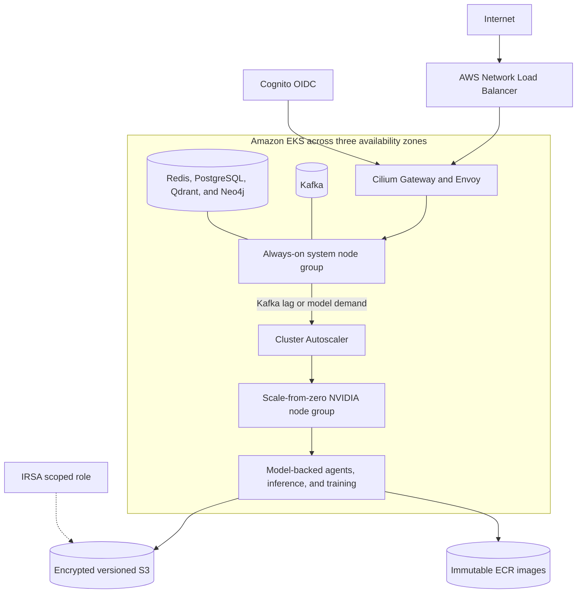

# AWS deployment

The Terraform root creates a three-AZ VPC, EKS, a two-node system group, a
scale-from-zero NVIDIA group, encrypted/versioned S3, immutable ECR repositories,
and an IRSA role scoped to the artifact bucket.



```bash
cd infrastructure/aws
cp terraform.tfvars.example terraform.tfvars
terraform init && terraform plan -out=tfplan
# Review cost and resources before explicitly applying:
terraform apply tfplan
$(terraform output -raw configure_kubectl)
```

EKS is created without VPC CNI or kube-proxy because Cilium owns those roles.
Install Gateway CRDs and Cilium immediately after the control plane is ready:

```bash
kubectl apply -f https://github.com/kubernetes-sigs/gateway-api/releases/download/v1.4.0/standard-install.yaml
helm repo add cilium https://helm.cilium.io
helm upgrade --install cilium cilium/cilium --version 1.20.0 -n kube-system \
  -f ../../deploy/cilium/values-common.yaml -f ../../deploy/cilium/values-aws.yaml
```

Install NVIDIA GPU Operator, Strimzi Kafka, KEDA, Cluster Autoscaler, Prometheus,
and optionally MLflow using their maintained charts. Cluster Autoscaler must use
auto-discovery for the Terraform cluster tags; otherwise GPU groups remain at
zero. Install the AWS Load Balancer Controller so Gateway LoadBalancer Services
receive NLBs.

Create the runtime Secrets and namespace before Helm. `platform-runtime-secrets`
contains `REDIS_URL`; `knowledge-runtime-secrets` contains Neo4j password, JWT
issuer/audience/JWKS settings, and any model key. `platform-cache-secret` contains
a Redis `users.acl`; `knowledge-secrets` contains Neo4j's `neo4j-auth` and runtime
password values. Prefer External Secrets rather than imperative creation.
Map the Cognito Terraform outputs exactly as described in
[Authentication](AUTHENTICATION.md).
The AWS profile also enables private PostgreSQL and Qdrant reference
StatefulSets; create their Secrets and review the production managed-service
boundary in [PostgreSQL and Qdrant](DATA_SERVICES.md).

Set the chart service-account annotation to `model_store_role_arn`, object bucket
to `artifact_bucket`, image repositories to the ECR outputs, then deploy:

```bash
helm upgrade --install platform ../../deploy/helm/agentic-platform \
  -n agentic-platform --create-namespace \
  -f ../../deploy/helm/agentic-platform/values-aws.yaml
```
