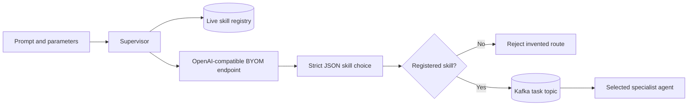
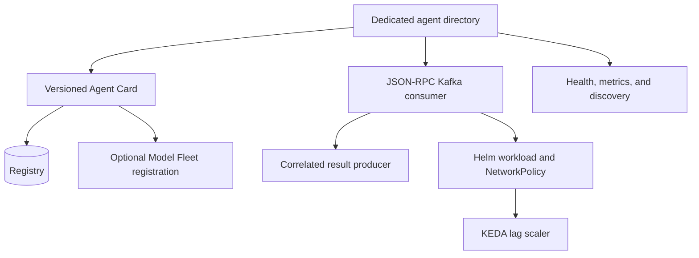

# Bring your own model or agent

## Bring your own model (BYOM)



The native supervisor supports any fixed OpenAI-compatible chat endpoint. Set
`LLM_GATEWAY_URL`, `LLM_GATEWAY_MODEL`, and optionally
`LLM_GATEWAY_API_KEY` in `platform-runtime-secrets`. `POST /v1/route` accepts a
prompt, asks the configured model to choose one skill from the active registry,
strictly validates the JSON response, rejects invented skills, and only then
publishes JSON-RPC to Kafka.

An explicit `skill` bypasses model selection but still must resolve through the
registry. The gateway is therefore a planner, not a policy or authorization
boundary. Keep it private, constrain egress to its fixed endpoint, and protect
the public supervisor route with the deployment's API/OIDC boundary.

```json
{
  "prompt": "Show the weather in Berlin",
  "params": {"units": "metric"}
}
```

The same vLLM endpoint can serve application inference and supervisor routing.
Model Fleet's Qwen examples show GPU-fit declarations and the important limits
of a 27B model on one 24 GiB card. A hosted provider also works when it exposes
the same API contract and its key comes from a Secret.

Knowledge extraction and embeddings are configured separately with
`OPENAI_BASE_URL`/`OPENAI_MODEL` and
`EMBEDDING_BASE_URL`/`EMBEDDING_MODEL`. Separate clients prevent Qdrant or one
model provider's credentials from being sent to another endpoint.

## Bring your own agent (BYOA)



An agent needs no supervisor code change. It must:

1. own a directory under `agents/` and a dedicated `tasks.<agent>` and
   `results.<agent>` topic;
2. publish an Agent Card with exact skill IDs and refresh its registration;
3. consume JSON-RPC tasks, publish a correlated result, then commit the Kafka
   input offset;
4. expose only discovery, health, and metrics over HTTP;
5. make handlers idempotent because delivery is at least once;
6. add a Helm workload, NetworkPolicy, and KEDA lag trigger.

PostgreSQL makes registrations durable across registry restarts. Model Fleet can
register the same card as an `AgentRegistration` and route it from Slack through
its authenticated supervisor. Tenant-bearing graph skills require an audited
Slack-to-OIDC identity mapping and are intentionally not enabled by default.

See [adding agents](ADDING_AGENTS.md), [agent internals](AGENT_ARCHITECTURE.md),
and [Model Fleet integration](MODEL_FLEET_INTEGRATION.md).
