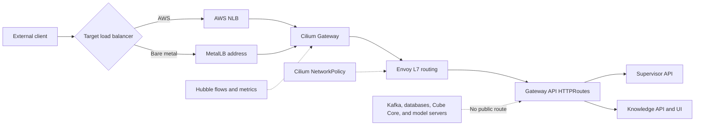

# Cilium networking and Gateway API

Cilium is the common data plane on both targets. Install standard Gateway API
CRDs first, then Cilium with `deploy/cilium/values-common.yaml` plus the target
values file. Required settings are `kubeProxyReplacement=true` and
`gatewayAPI.enabled=true`.



The platform chart creates a same-namespace `Gateway`. TLS is opt-in and must
reference a Secret managed by cert-manager or another certificate controller.
Production should disable the HTTP listener after HTTPS is verified.

```bash
kubectl get gatewayclass cilium
kubectl get gateway agentic-platform
kubectl get httproute
kubectl describe gateway agentic-platform
```

`Accepted=True`, `Programmed=True`, and `ResolvedRefs=True` are required. Hubble
is enabled for DNS, drops, TCP, flow, ICMP, and HTTP metrics. Do not include URL
paths, tokens, prompts, or document text as Prometheus labels.

On AWS, `Gateway.spec.infrastructure.annotations` configures the generated NLB.
On bare metal, MetalLB assigns its address; optionally set `gateway.addresses`
to a reserved address from the configured pool.

Cube API and Cube Store intentionally receive no `HTTPRoute`. BI requests enter
through the supervisor and continue over Kafka to the analytics specialist.
