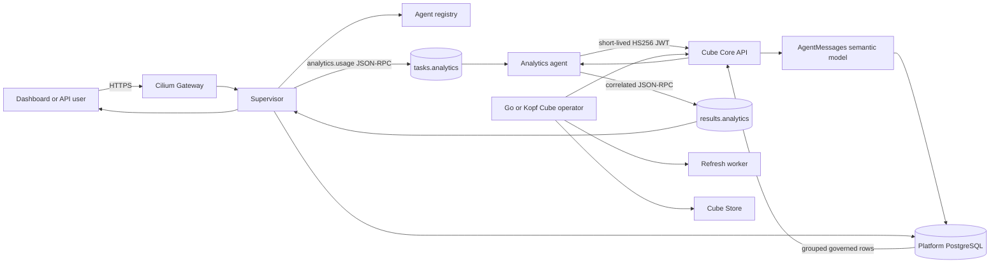
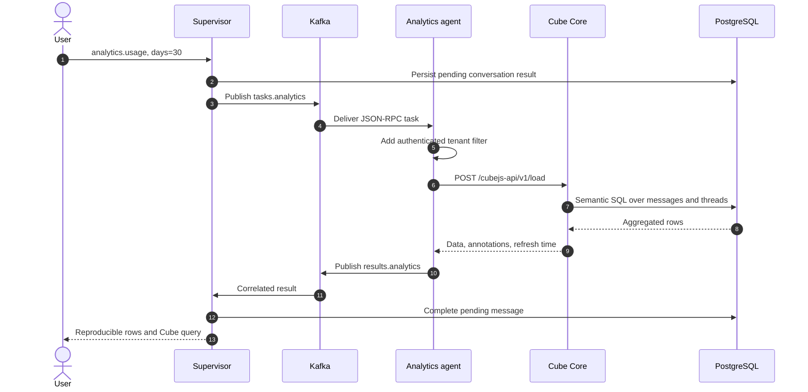
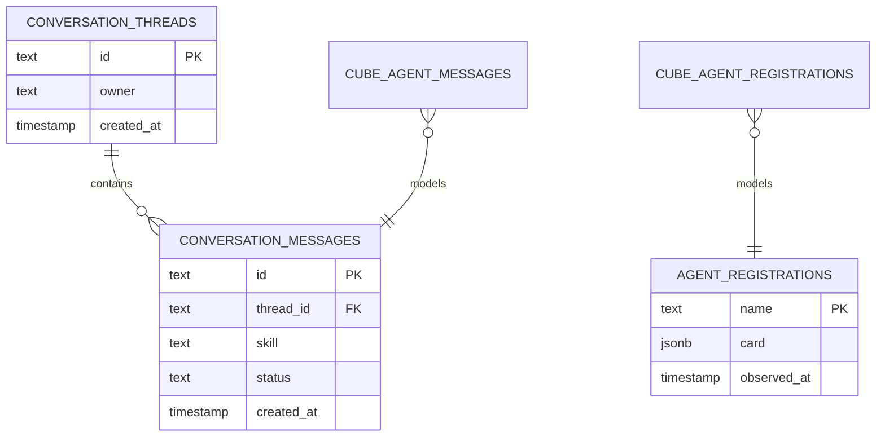

# Cube operator and agent-to-agent BI

This integration installs the sibling open-source `cube-microk8s-operator` into
the existing Kind cluster and models real platform tables in Cube Core. The
analytics specialist remains a normal Agent Card/Kafka worker; it calls Cube's
governed REST API instead of bypassing the platform's event contract.

## End-to-end architecture





## Install on the running Kind cluster

Prerequisites: the sibling repositories share one parent directory and
`terraform apply` has already created `kind-agentic-platform`.

```bash
cd /path/to/agentic-kubernetes-platform
./scripts/install-cube-analytics.sh
./scripts/verify-cube-analytics.sh
```

Override a non-sibling checkout with
`CUBE_OPERATOR_ROOT=/path/to/cube-microk8s-operator`. The installer:

1. builds and loads the Go operator into Kind;
2. applies its CRD/RBAC/controller;
3. derives Cube's PostgreSQL configuration from the existing Kubernetes Secret;
4. generates a separate random Cube API secret;
5. applies the model ConfigMap, PVC, and `CubeCluster`;
6. selects a digest-pinned amd64 or arm64 Cube Store image;
7. rebuilds the platform runtime and enables the analytics worker; and
8. waits for both the `CubeCluster` and worker.

It is idempotent and does not print credentials. To reuse an already loaded
runtime image, set `BUILD_RUNTIME_IMAGE=false`.

## Usage examples

From the dashboard select `analytics.usage` or `analytics.errors`, or dispatch
directly through Cilium and Kafka:

```bash
curl -s http://127.0.0.1:8080/v1/tasks \
  -H 'content-type: application/json' \
  -d '{"jsonrpc":"2.0","id":"bi-1","method":"analytics.usage","params":{"days":30}}'
```

`analytics.usage` returns task counts grouped by skill and status.
`analytics.errors` applies an additional error filter. Authenticated dashboard
requests also carry the conversation owner's tenant, which the specialist adds
as a Cube filter. Every result includes the exact semantic query for audit and
reproduction.

## Data model and extension



Add governed measures or views under `deploy/cube-analytics/model/`, then rerun
the installer. Add new analytics skills only as bounded semantic queries; do
not accept arbitrary SQL from prompts.

## Cube Cloud boundary

Cube's documented agent-to-agent Chat API streams natural-language answers and
is a Cube Cloud Premium/Enterprise feature. This open-source Kind example uses
Cube Core's `/cubejs-api/v1/load` endpoint and our Kafka analytics specialist.
It demonstrates the same delegation boundary without claiming Cloud Chat,
multi-turn `chatId`, or hosted Cube agents are present in Cube Core.

For production, use the Cube operator's clustered/S3 profile, external secret
management, TLS, and a narrowly scoped JWT policy. Cube Store and PostgreSQL
remain private; only the supervisor is reachable through Cilium Gateway API.
