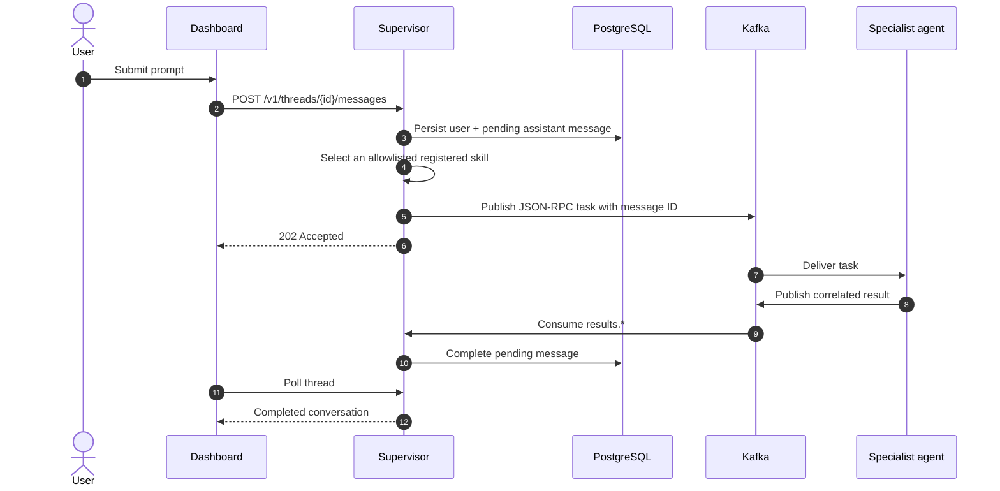
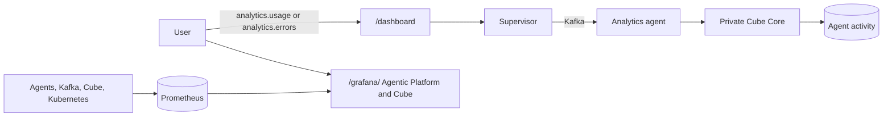

# Conversations dashboard

The supervisor serves a deliberately small dashboard at `/dashboard`. It uses
the same Cognito or Keycloak OIDC PKCE login as the graph explorer. In local
Compose and kind only, authentication is disabled and all work belongs to the
`local-development` identity.

PostgreSQL owns threads, messages, state, selected skill, and the original
JSON-RPC result. The UI labels work as pending until a correlated Kafka result
arrives; an accepted task is never presented as a completed answer.

## Sharing and isolation

- Thread APIs derive the owner from a verified JWT `(issuer, sub)` identity.
- Every owner query includes that subject; callers cannot select another
  subject from request data.
- **Share** rotates a 256-bit unlisted token and returns a read-only URL.
- PostgreSQL stores only SHA-256 token digests, not usable share tokens.
- `DELETE /v1/threads/{id}/share` immediately revokes the link.
- Shared views cannot submit prompts or enumerate other conversations.

The dashboard is a compact reference UI, not a second agent runtime. New agents
appear automatically because routing and result collection use Agent Cards and
the `results.*` topic pattern.

The separate `/knowledge/` dashboard shows durable ingestion state, source
inventory, metrics, authenticated source/page previews, and 2D/3D graph views.
Its ForceAtlas map and selected-neighborhood view keep dense multi-document
knowledge understandable, including ontology category hubs. Thin animated
connection pulses, picture glows, and lazy authenticated thumbnails add
demoscene polish without obscuring labels. Graph movie mode
walks connected components, highlights each node and incident relationship, and
presents evidence while moving the 2D viewport or 3D camera. A spacious fractal
cinema cycles through Buddhabrot, dragon, Julia, Sierpiński, Hausdorff Cantor
dust, and an animated 4D tesseract projection
before a live Conway matrix in monochrome green. Every layout is
available in 2D, 3D, and projected 4D and preserves the semantic graph. Density and curve
guides expose each fractal silhouette, ASCII voxel glyphs keep the overview
sparse, labels progressively appear during zoom, and translucent tiles keep
individual objects visible without crowding. See the
[knowledge agent guide](../agents/knowledge-graph/README.md).
Relationships use thin dash-dot strokes and directional particles so topology
remains visible without obscuring the fractal silhouette.
Luminous mathematical halo scaffolds trace the complete requested shape
independently of data volume; actual entities and relationships remain embedded
inside the scaffold rather than being replaced by decorative points.

The selected target is offset left so it is not covered by the optional details
HUD. Users can disable the HUD with **Show target details** or drag it to any
canvas position. Caption-matched images render inside 2D nodes and remain visible
under pan and zoom. Active nodes use a red additive glow in 2D and 3D; the HUD
types target metadata and connections with a red scanning target-lock effect.

After installing the Cube profile, `analytics.usage` and `analytics.errors`
appear automatically. The dashboard still calls only the supervisor; the
specialist reaches private Cube Core and returns a correlated Kafka result. See
[Cube analytics](CUBE_ANALYTICS.md).

## Analytics views

- Agent BI: `http://127.0.0.1:8080/dashboard`
- Operational analytics: `http://127.0.0.1:8080/grafana/d/agentic-platform-cube/agentic-platform-and-cube`
- Local Grafana credentials come from the `monitoring-grafana` Secret. Cube Core
  intentionally has no public dashboard in production mode; agents use its
  authenticated API and Grafana displays its operational metrics.

## API

| Method | Path | Purpose |
|---|---|---|
| `POST` | `/v1/threads` | Create an owned thread |
| `GET` | `/v1/threads` | List owned threads |
| `GET` | `/v1/threads/{id}` | Read messages and states |
| `POST` | `/v1/threads/{id}/messages` | Persist and dispatch a prompt |
| `POST` | `/v1/threads/{id}/share` | Rotate/create a read-only link |
| `DELETE` | `/v1/threads/{id}/share` | Revoke sharing |
| `GET` | `/v1/shared/{token}` | Read one shared thread |
