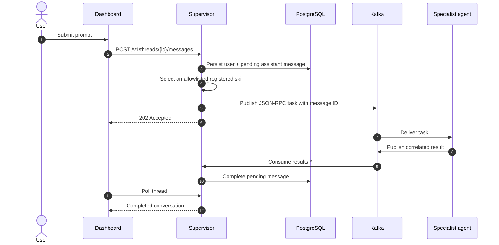

# Conversations dashboard

The supervisor serves a deliberately small dashboard at `/dashboard`. It uses
the same Cognito or Keycloak OIDC PKCE login as the graph explorer. In local
Compose and kind only, authentication is disabled and all work belongs to the
`local-development` identity.

PostgreSQL owns threads, messages, state, selected skill, and the original
JSON-RPC result. The UI labels work as pending until a correlated Kafka result
arrives; an accepted task is never presented as a completed answer.

## Sharing and isolation

- Thread APIs derive the owner from a verified JWT `(issuer, sub)` identity.
- Every owner query includes that subject; callers cannot select another
  subject from request data.
- **Share** rotates a 256-bit unlisted token and returns a read-only URL.
- PostgreSQL stores only SHA-256 token digests, not usable share tokens.
- `DELETE /v1/threads/{id}/share` immediately revokes the link.
- Shared views cannot submit prompts or enumerate other conversations.

The dashboard is a compact reference UI, not a second agent runtime. New agents
appear automatically because routing and result collection use Agent Cards and
the `results.*` topic pattern.

After installing the Cube profile, `analytics.usage` and `analytics.errors`
appear automatically. The dashboard still calls only the supervisor; the
specialist reaches private Cube Core and returns a correlated Kafka result. See
[Cube analytics](CUBE_ANALYTICS.md).

## API

| Method | Path | Purpose |
|---|---|---|
| `POST` | `/v1/threads` | Create an owned thread |
| `GET` | `/v1/threads` | List owned threads |
| `GET` | `/v1/threads/{id}` | Read messages and states |
| `POST` | `/v1/threads/{id}/messages` | Persist and dispatch a prompt |
| `POST` | `/v1/threads/{id}/share` | Rotate/create a read-only link |
| `DELETE` | `/v1/threads/{id}/share` | Revoke sharing |
| `GET` | `/v1/shared/{token}` | Read one shared thread |
