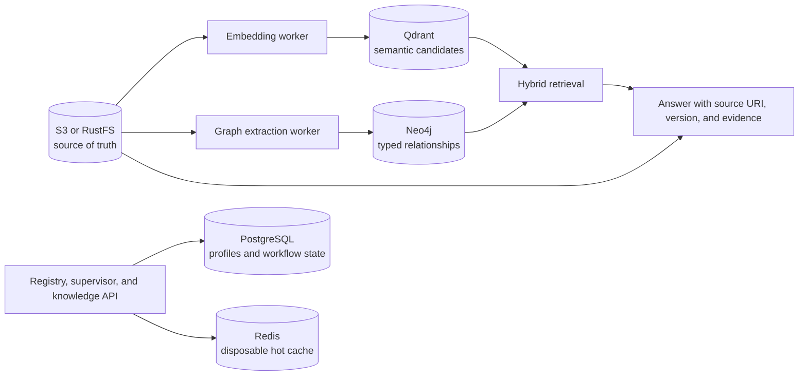

# PostgreSQL and Qdrant

The platform profiles include two optional private data services:

- **PostgreSQL** stores durable Agent Cards and provider-neutral application
  profiles, and can hold workflow state, approvals, schedules, tool
  configuration, and audit references.
- **Qdrant** stores embedding vectors and payload metadata for semantic search,
  retrieval, and hybrid graph/vector agent workflows.

They complement rather than replace the existing stores. S3/RustFS remains the
source of truth for documents, models, datasets, and exports. Neo4j owns explicit
entities and relationships. Redis owns disposable hot cache entries.



The registry writes `agent_registrations`. The authenticated knowledge API
writes `platform_users`, keyed by OIDC issuer and subject, when
`GET /v1/users/me` is called. Cognito remains the managed credential authority;
Keycloak uses its own isolated PostgreSQL database for credentials and realm
state. Do not store passwords or bearer tokens in the application tables.

A retrieval agent can ask Qdrant for semantically similar chunks, traverse the
corresponding entities in Neo4j, and cite the original S3/RustFS object. Keep the
object URI, version, checksum, tenant, ontology, and embedding-model version in
the vector payload so an index can be rebuilt rather than becoming the only copy
of source data.

## Helm configuration

The AWS and bare-metal values enable both services. The base values keep them
disabled so existing installations do not acquire new stateful dependencies.
Before installing either profile, create these Secrets through External Secrets,
Sealed Secrets, or the cluster's secret manager:

| Secret | Required keys |
|---|---|
| `platform-postgresql-secret` | `database`, `username`, `password` |
| `platform-qdrant-secret` | `api-key` |
| `platform-runtime-secrets` | `POSTGRES_URL`, gateway and Kafka settings |
| `knowledge-runtime-secrets` | OIDC, Neo4j, embedding, and model settings |

Internal endpoints are `postgresql:5432`, `qdrant:6333` for HTTP, and
`qdrant:6334` for gRPC. They have no Cilium `HTTPRoute` and must not be exposed
through the public Gateway. Override `storageClassName`, requested storage, and
resources for the target cluster.

```yaml
postgresql:
  enabled: true
  storageClassName: gp3
  storage: 100Gi
qdrant:
  enabled: true
  storageClassName: gp3
  storage: 200Gi
```

The bundled StatefulSets are single-replica reference deployments. For a
production availability objective, use managed PostgreSQL (for example RDS), a
PostgreSQL operator with tested backup/failover, and a multi-node Qdrant cluster
with replication. Point agents at those private endpoints and disable the
bundled instances. Scaling a StatefulSet replica count without database-level
replication configuration is not high availability.

## Recovery and index lifecycle

Back up PostgreSQL with transaction-consistent dumps or physical backups and
test restoration. Create Qdrant collection snapshots and copy them to S3/RustFS.
An embedding index must record its model/version and distance metric; changing
any of them requires a new collection and controlled re-index. Validate restored
row counts, vector counts, collection aliases, tenant filters, and sample queries
before switching traffic.

Local Compose exposes both services on loopback only and uses explicitly
development-only credentials. Kubernetes never includes credentials in chart
values or rendered environment literals.
