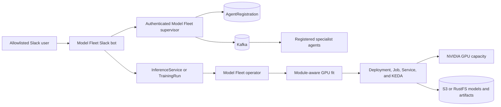

# Model Fleet integration

The platform and Model Fleet are separate open-source projects with independent
versions. The platform owns agents, Kafka, Redis, identity, storage, and the two
infrastructure profiles. Model Fleet owns Kubernetes inference/training intent,
GPU-fit placement, generated workloads, and the optional Slack operations
surface. Their stable boundary is Agent Cards, JSON-RPC/Kafka, and Kubernetes
custom resources—not source-code imports.



## Install together

Install the Model Fleet chart first so its CRDs exist. The checked-in values are
an explicit integration example; replace allowlists, image coordinates, Kafka
security, and Secrets before use. Use `profile=aws` on EKS.

```bash
helm upgrade --install model-fleet ../model-fleet-operator/charts/model-fleet-operator \
  -n agentic-platform --create-namespace \
  -f deploy/model-fleet/values.yaml

helm upgrade --install platform deploy/helm/agentic-platform \
  -n agentic-platform \
  -f deploy/helm/agentic-platform/values-baremetal.yaml \
  -f deploy/helm/agentic-platform/values-model-fleet.yaml
```

`model-fleet-control` must contain `slack-bot-token`, `slack-app-token`,
`slack-signing-secret`, and `control-plane-api-key`. Use External Secrets or the
cluster's equivalent; never commit those values. The Model Fleet supervisor and
Slack bot use the same Kafka bootstrap servers as the agents.

The platform's optional Helm template registers the tenant-neutral weather
skills with Model Fleet. Agent workloads remain KEDA-owned and are therefore
registration-only; Model Fleet does not directly scale those Deployments and
cannot fight their Kafka lag scaler. Model inference and training are expressed
as Model Fleet CRs and are fully controllable from Slack.

Graph skills are excluded because the graph API uses OIDC subjects as tenant
IDs while Slack has a different identity namespace. Add graph routing only with
an audited identity mapping; never substitute a Slack ID for an OIDC subject.

## Slack policy boundary

Read-only status can be broader. Workload changes, quota requests, and `run`
require `SLACK_ALLOWED_USER_IDS`; channels can be constrained separately.
Destructive operations require explicit confirmation. `run` submits to an
authenticated supervisor and then Kafka—it never calls an agent directly.

```text
/fleet status agentic-platform
/fleet run weather.current "weather in Tokyo"
/fleet sleep models/large-model confirm
/fleet pause training models/adapter-run
```

The model-fleet result consumer ignores correlated results it does not own, so
the platform's native supervisor and Model Fleet supervisor can share result
topics. Both keep independent consumer groups and task ownership.
