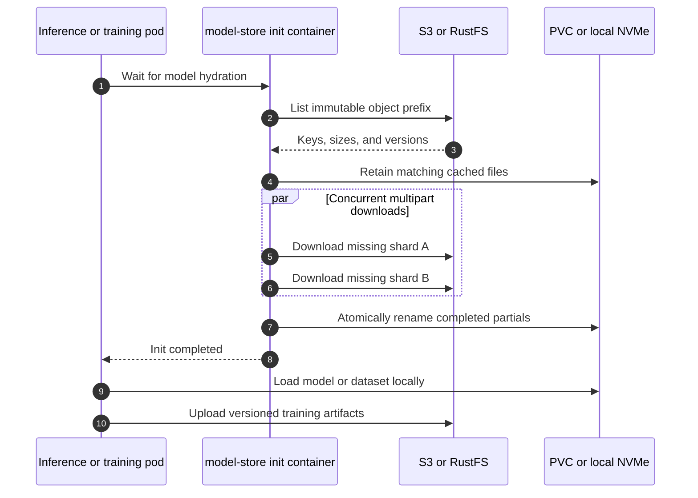

# Model, dataset, and artifact storage

Use identical object keys on both targets:

```text
models/<model>/<immutable-version>/...
datasets/<dataset>/<version>/...
documents/<tenant-hash>/<document-id>/...
artifacts/<run-id>/...
```



AWS SDK credential discovery uses IRSA on EKS. Bare metal sets an S3-compatible
endpoint and RustFS credentials from a Secret. Application code never branches
on provider.

The cache must be large enough for model shards plus temporary partial files.
Use ReadWriteOnce local NVMe for one serving pod per cache, or a storage backend
whose access mode and throughput match multiple readers. Verify checksums before
promoting model prefixes; the current loader skips same-size files and is not a
cryptographic integrity verifier.
