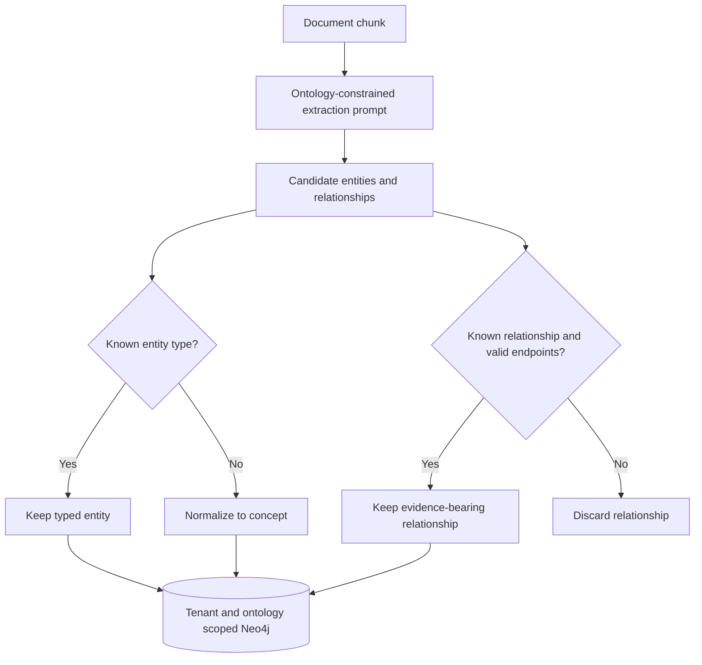
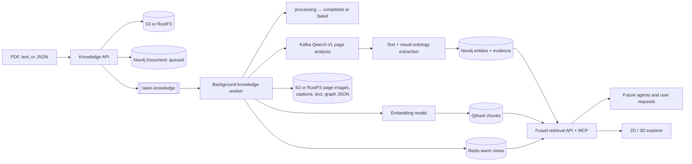

# Graph ontologies

Ontologies make extraction predictable: they define versioned entity and
relationship identifiers, human descriptions, visualization colors, and
optional source/target type constraints. The worker includes the selected
ontology in the model prompt and validates the extracted graph before Neo4j
persistence. Unsupported entity types become `concept`; unsupported or
type-invalid relationships are discarded rather than silently polluting the
graph.

Neo4j entity identity is `(tenant, ontology, name)`. Queries and Redis cache
keys are ontology-scoped, preventing equally named entities in two schemas from
overwriting or leaking into each other's traversals.

After validation, same-type expanded names are conservatively canonicalized.
For example, `Roman Space Telescope` can become an alias of `Nancy Grace Roman
Space Telescope`; existing mentions and relationships are rewired to the
canonical node and aliases remain queryable. Ambiguous short forms such as
`Roman` are not merged without stronger evidence.

Three ontologies ship with the platform:

- `core@1.0.0`: people, organizations, places, events, concepts, and documents.
- `astronomy@1.0.0`: extends core with observatories, missions, instruments,
  subsystems, targets, measurements, constraints, processes, and catalogs.
- `industry@1.0.0`: assets, components, locations, people, organizations,
  documents, procedures, events, certifications, materials, metrics, risks,
  projects, routes, and models. Its relationship vocabulary covers structure,
  operation, provenance, compliance, causality, logistics, and ML lineage.



Select one with `DocumentIngest.ontology` or the upload form's `ontology`
field. Discover definitions through `GET /v1/knowledge/ontologies`,
`GET /v1/knowledge/ontologies/{id}`, or the `graph.ontology` MCP tool. The graph
UI uses the same source of truth for type filters and node colors.

The explorer defaults to a ForceAtlas knowledge map in which real relationships
produce organic clusters. Optional Buddhabrot, dragon-curve, and Conway Life
projections are presentation views; they never invent relationships. Fractal
cinema cycles through all three in 2D or 3D. Selected-neighborhood mode redraws two
hops around a chosen node, while complete-graph mode is available when density
is intentional. Low-degree document
reference nodes are hidden by default but remain filterable. Details expose
semantic properties, aliases, evidence, connections, and authenticated source
images while removing renderer-only coordinates. Caption-matched images render
inside zoomable 2D nodes. The optional target HUD is draggable, and selected
nodes shift left so the HUD does not obscure their neighborhood. Selected and
tour nodes use a red 2D/3D glow, while semantic details type into the target HUD.

Every entity is also connected to an explicit `Category · <type>` ontology hub
through `classified_as`. Category hubs make isolated and unknown discoveries
navigable without claiming an unsupported relationship between two entities.
The startup backfill adds these idempotently to existing tenant graphs.

The authenticated graph API is intentionally constrained rather than accepting
raw Cypher:

| Endpoint | Purpose |
|---|---|
| `GET /v1/knowledge/documents` | List files and `queued`, `processing`, `completed`, or `failed` state |
| `GET /v1/knowledge/stats` | Count documents, entities, relationships, vectors, and active work |
| `GET /v1/knowledge/graph` | Browse up to 500 nodes by ontology, type, and repeated `document_id` filters |
| `GET /v1/knowledge/search?q=...` | Find entities and their immediate relationships |
| `GET /v1/knowledge/fused-search?q=...` | Return graph matches and Qdrant semantic matches together |
| `GET /v1/knowledge/neighbors/{name}` | Expand a named entity by one to three hops |
| `GET /v1/knowledge/path?source=...&target=...` | Trace a shortest path of up to eight hops |

Every query derives the tenant from the signature-verified OIDC token and
includes both tenant and ontology predicates in Neo4j. The same browse operation
is available to agents as the `graph.visualize` MCP tool. The web explorer uses
the browse API for its initial graph, then supports ontology filtering, 2D force
layout, 3D WebGL layout, directed edges and particles, degree-based sizing, and
click-through node or relationship evidence.

## Institutional knowledge workflow

Each upload creates a durable Neo4j `Document` record before Kafka accepts the
background job. The UI polls only while work is active, shows failures instead
of silently losing them, and reports entity, relationship, and vector counts
when processing completes. Select one or more files to compare only those
sources in 2D or 3D; clear the selection to explore the accumulated graph.



This makes ingested material reusable rather than tied to one conversation:

- Neo4j preserves explicit facts, provenance, evidence, and traversable paths.
- Qdrant retrieves semantically similar passages even when wording differs.
- `knowledge.fused-search` combines both result types for people or agents and
  accepts `document_ids` to constrain provenance.
- Redis generation keys invalidate stale tenant data after writes. Completion
  proactively warms document inventory, metrics, and the common complete-graph
  view; exact fused queries are cached after first use. This is deterministic
  anticipatory caching, not an unverified predictive-ML claim.

For example, ingest JWST and Roman Space Telescope PDFs under `astronomy`.
Selecting both renders shared and distinct entities; selecting one isolates its
provenance; selecting neither renders all astronomy knowledge owned by the
signed-in user.

```bash
# Poll ingestion and metrics. Repeat document_id to filter multiple sources.
curl -sS -H "Authorization: Bearer $TOKEN" \
  'http://127.0.0.1:8080/knowledge/v1/knowledge/documents?ontology=astronomy'
curl -sS -H "Authorization: Bearer $TOKEN" \
  'http://127.0.0.1:8080/knowledge/v1/knowledge/stats?ontology=astronomy'
curl -sS -H "Authorization: Bearer $TOKEN" \
  'http://127.0.0.1:8080/knowledge/v1/knowledge/fused-search?q=mirror&ontology=astronomy&document_id=DOC_ID'
```

Add another ontology as a versioned `Ontology` in `ontology.py`. Never change
the meaning of an existing identifier in place: publish a new ontology version
and migrate stored graph data explicitly.
