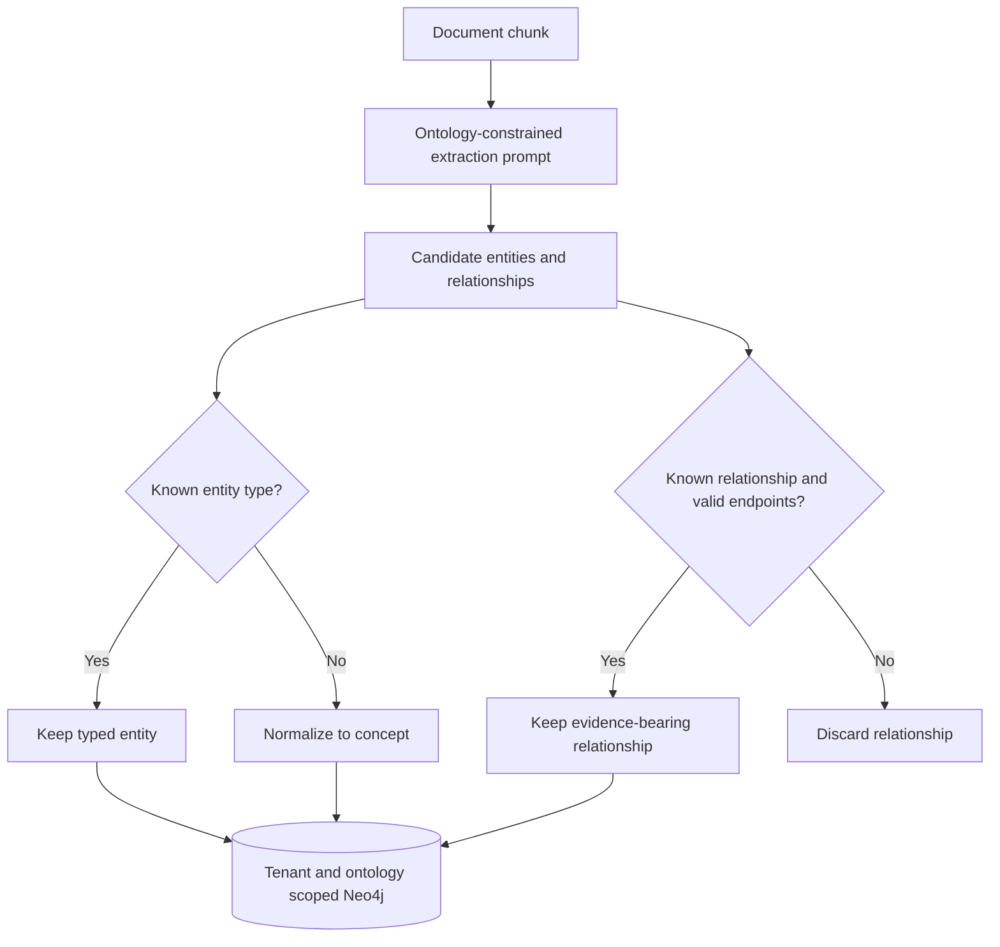

# Graph ontologies

Ontologies make extraction predictable: they define versioned entity and
relationship identifiers, human descriptions, visualization colors, and
optional source/target type constraints. The worker includes the selected
ontology in the model prompt and validates the extracted graph before Neo4j
persistence. Unsupported entity types become `concept`; unsupported or
type-invalid relationships are discarded rather than silently polluting the
graph.

Neo4j entity identity is `(tenant, ontology, name)`. Queries and Redis cache
keys are ontology-scoped, preventing equally named entities in two schemas from
overwriting or leaking into each other's traversals.

Three ontologies ship with the platform:

- `core@1.0.0`: people, organizations, places, events, concepts, and documents.
- `astronomy@1.0.0`: extends core with observatories, missions, instruments,
  subsystems, targets, measurements, constraints, processes, and catalogs.
- `industry@1.0.0`: assets, components, locations, people, organizations,
  documents, procedures, events, certifications, materials, metrics, risks,
  projects, routes, and models. Its relationship vocabulary covers structure,
  operation, provenance, compliance, causality, logistics, and ML lineage.

Select one with `DocumentIngest.ontology` or the upload form's `ontology`
field. Discover definitions through `GET /v1/knowledge/ontologies`,
`GET /v1/knowledge/ontologies/{id}`, or the `graph.ontology` MCP tool. The graph
UI uses the same source of truth for type filters and node colors.

The authenticated graph API is intentionally constrained rather than accepting
raw Cypher:

| Endpoint | Purpose |
|---|---|
| `GET /v1/knowledge/graph` | Browse up to 500 nodes, optionally filtered by ontology and entity type |
| `GET /v1/knowledge/search?q=...` | Find entities and their immediate relationships |
| `GET /v1/knowledge/neighbors/{name}` | Expand a named entity by one to three hops |
| `GET /v1/knowledge/path?source=...&target=...` | Trace a shortest path of up to eight hops |

Every query derives the tenant from the signature-verified OIDC token and
includes both tenant and ontology predicates in Neo4j. The same browse operation
is available to agents as the `graph.visualize` MCP tool. The web explorer uses
the browse API for its initial graph, then supports ontology filtering, 2D force
layout, 3D WebGL layout, directed edges and particles, degree-based sizing, and
click-through node or relationship evidence.

Add another ontology as a versioned `Ontology` in `ontology.py`. Never change
the meaning of an existing identifier in place: publish a new ontology version
and migrate stored graph data explicitly.
