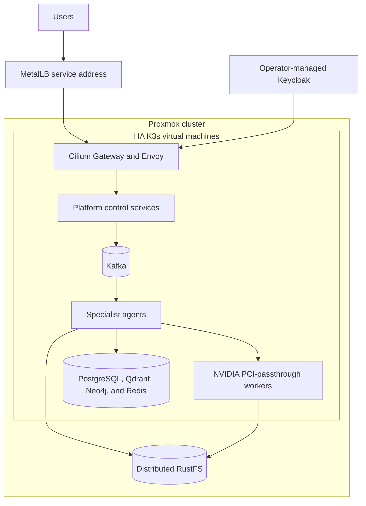

# Proxmox and bare-metal deployment

## Host prerequisites

- Proxmox VE with an Ubuntu 24.04 cloud-init template and snippets datastore.
- Three static VM addresses and a separate MetalLB LAN range outside DHCP.
- IOMMU/VFIO enabled on GPU hosts. Create cluster PCI resource mappings for each
  NVIDIA card and assign each mapping to at most one VM.
- East-west firewall access among K3s servers and a trusted SSH key.



```bash
cd infrastructure/proxmox
cp terraform.tfvars.example terraform.tfvars
export TF_VAR_proxmox_api_token='terraform@pve!platform=REPLACE_ME'
terraform init && terraform plan -out=tfplan
terraform apply tfplan

SSH_PRIVATE_KEY="$HOME/.ssh/id_ed25519" \
METALLB_ADDRESS_POOL="192.168.20.200-192.168.20.220" \
./scripts/bootstrap-k3s.sh
```

The script forms HA K3s without Flannel, kube-proxy, ServiceLB, or Traefik;
installs Cilium and Gateway API; installs MetalLB; labels mapped GPU nodes; and
installs NVIDIA GPU Operator. Confirm `nvidia.com/gpu` capacity before scheduling.

## RustFS

Use the official RustFS chart. Distributed mode is represented in
`deploy/rustfs/values.yaml`. Supply unique credentials through a private values
file or secret manager and pin the chart/image version you validated:

```bash
helm repo add rustfs https://charts.rustfs.com
helm upgrade --install rustfs rustfs/rustfs -n rustfs --create-namespace \
  -f ../../deploy/rustfs/values.yaml
```

Create `models` and `agent-documents` buckets. Set `OBJECT_STORE_ENDPOINT` and
`MODEL_STORE_ENDPOINT` to the cluster-internal RustFS S3 API. Keep RustFS off the
public Gateway. Production distributed storage needs independent disks/failure
domains; four PVCs on one physical disk are not fault tolerant.

Install Strimzi, KEDA, Prometheus, and the platform chart with
`values-baremetal.yaml`. MetalLB supplies the Cilium Gateway address. Router or
firewall forwarding is a separate boundary if Internet access is required.
The bare-metal values create a Keycloak custom resource; install the official
Keycloak Operator first, then configure its realm and browser login after the
first Helm install by following [Authentication](AUTHENTICATION.md).
They also enable private PostgreSQL and Qdrant StatefulSets. Place their PVCs on
durable storage and follow [the backup and scaling guidance](DATA_SERVICES.md).
