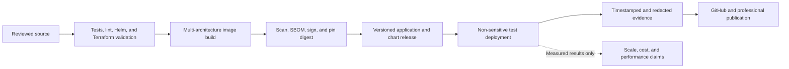

# Publishing the open-source project

This repository is usable as a reference implementation, a forkable template,
or a base for additional specialist agents. Publish the platform and Model
Fleet as independent projects and pin compatible versions in deployment
configuration. Do not merge their source trees: their Agent Card, Kafka, and
Kubernetes APIs are the intentional integration boundary.



## GitHub documentation map

| Audience | Document |
|---|---|
| Platform architects | [Platform architecture](ARCHITECTURE.md) |
| Agent builders | [Agent architecture](AGENT_ARCHITECTURE.md) and [adding agents](ADDING_AGENTS.md) |
| Model/GPU operators | [Model Fleet integration](MODEL_FLEET_INTEGRATION.md) |
| Model and agent integrators | [Bring your own model or agent](BRING_YOUR_OWN.md) |
| Security reviewers | [Authentication](AUTHENTICATION.md) and [Cilium networking](CILIUM.md) |
| Infrastructure operators | [AWS](AWS.md), [Proxmox](PROXMOX.md), [data services](DATA_SERVICES.md), and [model storage](MODEL_STORAGE.md) |
| Reviewers validating claims | [Verification and evidence](VERIFICATION.md) |

## Release checklist

1. Run every check in [Verification](VERIFICATION.md) from a clean checkout.
2. Build multi-architecture images, scan them, generate an SBOM, sign immutable
   digests, and update chart defaults to digests or immutable tags.
3. Review Terraform plans and rendered Helm YAML; publish no state, plans,
   credentials, or environment-specific identifiers.
4. Version the chart and application independently when their contracts differ.
5. Publish a compatibility table for Kubernetes, Cilium, KEDA, Kafka, GPU
   Operator, Cognito/Keycloak, S3/RustFS, and Model Fleet versions actually
   tested.
6. Attach source-level logs separately from redacted deployment evidence.

No checked-in command pushes an image, publishes a chart, applies Terraform, or
changes a cluster without an explicit operator action.

## LinkedIn-ready narrative

> I built an open-source, event-driven Kubernetes platform for specialist AI
> agents that runs on AWS EKS or bare-metal Proxmox/K3s. Agent work is routed as
> correlated JSON-RPC over Kafka; Redis handles hot reads, S3 or RustFS holds
> durable documents/models, and Cilium Gateway API provides the public network
> boundary. The weather example demonstrates a lightweight tool agent. The JWST
> knowledge-graph example demonstrates authenticated document ingestion,
> ontology-constrained extraction, Neo4j traversal, MCP tools, and 2D/3D graph
> exploration with the expensive worker scaling to zero.
>
> The companion Model Fleet operator adds declarative inference/training CRDs,
> module-aware GPU-fit selection, KEDA scaling, and an allowlisted Slack control
> surface. Slack can inspect or control workloads and route exact agent skills,
> but agent execution still travels through the authenticated supervisor and
> Kafka. The projects remain independently reusable and compose through public
> contracts rather than shared internals.

Use only evidence captured with [Verification](VERIFICATION.md). Good supporting
images are: the architecture flow, graph explorer 2D/3D views, Slack App Home,
an `InferenceService` status beside allocated GPU capacity, and a Hubble/Grafana
request trace. Add a caption with revision, environment, and timestamp. Do not
claim production scale, benchmark speed, savings, or availability until those
measurements are published with methodology.

## Architecture image source

The repository includes a publication-ready conceptual illustration at
[`docs/assets/platform-architecture.png`](assets/platform-architecture.png).
It explains the topology but is not deployment evidence.

This compact layout is suitable for a GitHub README screenshot or redrawing in
a design tool without changing its meaning:

```text
Users -> Cilium Gateway -> Identity + APIs -> Supervisors -> Kafka -> Agents
                              |                              |       |
                         Graph UI/API                    Redis   tools/models
                              |                                      |
                         Neo4j + S3/RustFS <- Model Fleet <- GPU inference/training
```

Keep vendor-neutral labels in the main image, then use a second comparison image
for AWS (`EKS + S3 + Cognito`) and bare metal
(`Proxmox/K3s + RustFS + Keycloak + MetalLB`).
