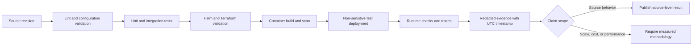

# Verification and evidence

The repository separates source-level proof from deployment proof. A passing
unit test or rendered manifest is evidence of its stated scope, not evidence of
a production deployment, GPU throughput, availability, or cost reduction.



## Reproducible local checks

```bash
make install
make lint
make test
helm lint deploy/helm/agentic-platform
helm template platform deploy/helm/agentic-platform \
  -f deploy/helm/agentic-platform/values-baremetal.yaml >/tmp/platform.yaml
terraform -chdir=infrastructure/aws validate
terraform -chdir=infrastructure/proxmox validate
terraform -chdir=infrastructure/keycloak validate
terraform -chdir=infrastructure/kind validate
docker compose config --quiet
```

These prove Python behavior under tests, coverage enforcement, valid Helm
rendering, valid Terraform configuration, and Compose structure. Tests mock
cloud APIs and external services. Container builds additionally require a live
Docker daemon.

## Kind, knowledge, Cube, and Grafana

```bash
terraform -chdir=infrastructure/kind apply
./scripts/install-cube-analytics.sh
./scripts/install-monitoring.sh
./scripts/verify-cube-analytics.sh

kubectl --context kind-agentic-platform get nodes
kubectl --context kind-agentic-platform get pods -A
kubectl --context kind-agentic-platform -n agentic-platform \
  get gateway,httproute,scaledobject,cubecluster
kubectl --context kind-agentic-platform -n monitoring \
  get deploy,statefulset,pods,servicemonitor
curl --fail http://127.0.0.1:8080/knowledge/health
curl --fail --head http://127.0.0.1:8080/grafana/
open http://127.0.0.1:8080/grafana/d/agentic-platform-cube/agentic-platform-and-cube
open http://127.0.0.1:8080/dashboard
```

For authenticated visual evidence, sign in at `/knowledge/`, select an entity
with extracted pages, and verify its image requests return 200 rather than 401.
Exercise ForceAtlas, Buddhabrot, dragon, Conway Life, fractal cinema, and
selected-neighborhood views in 2D and 3D and confirm
clicking a node focuses or redraws the graph to the left of the details HUD.
Confirm protected pictures render inside 2D nodes while zooming, cinematic
selection glows red in both renderers, the target HUD types its details, and
**Show target details** hides/restores the draggable HUD. Confirm `Category · <type>` nodes connect formerly isolated entities. The
details panel must contain semantic properties and connections but no `x`, `y`,
`z`, `vx`, `vy`, or `vz` fields.

## Deployment evidence checklist

Capture against a non-sensitive test environment and label every item with the
source revision, UTC time, cluster profile, and command. Redact tokens, account
IDs, private hostnames, user data, and document content.

1. `kubectl get pods,scaledobjects,httproutes -A` showing ready control-plane
   services and scale-to-zero workers.
2. A weather request ID, its Kafka task/result correlation, and returned source
   data.
3. The graph UI after authenticated JWST ingestion, with ontology-filtered 2D
   and 3D views and a traced relationship.
4. S3 or RustFS object metadata proving the source/model object exists—never a
   signed URL or credential.
5. Model Fleet CR status plus generated Deployment/Job, GPU node labels, and
   `nvidia.com/gpu` allocation for a real model workload.
6. A redacted Slack App Home and `/fleet run weather.current ...` response.
7. Hubble flows through the Cilium Gateway and Grafana/Prometheus panels for the
   same request window.
8. Cognito or Keycloak signup, login, logout, and an API request rejected
   without a token.
9. `scripts/verify-cube-analytics.sh` showing a Ready `CubeCluster` and a
   completed tenant-scoped `analytics.usage` result through Cilium, Kafka, Cube
   Core, and PostgreSQL; retain its query payload as evidence.

Screenshots support machine-readable status; they do not replace it. If a step
was not run, publish it as “not deployment-verified” rather than expected
behavior.
