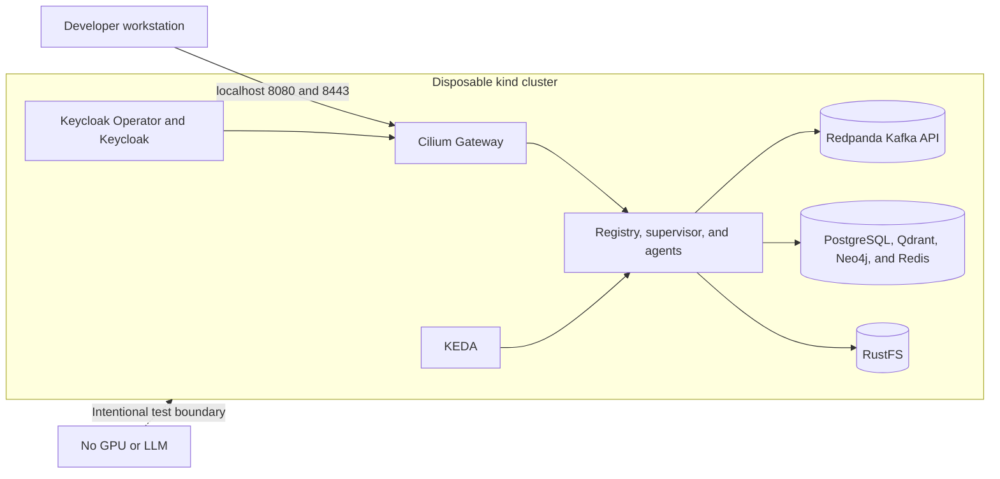

# Disposable kind environment

This Terraform root creates a local kind cluster with the default CNI and
kube-proxy disabled, then installs Gateway API, Cilium/Envoy/Hubble, KEDA, the
official Keycloak Operator, Redpanda's Kafka-compatible broker, RustFS, and the
platform chart. PostgreSQL, Qdrant, Neo4j, Redis, the registry, supervisor,
weather agent, graph API/UI, and operator-managed Keycloak run in-cluster.

Local credentials are fixed and development-only. The environment has no GPU or
embedding/LLM server, so it verifies control-plane, identity, persistence,
networking, Kafka, and lightweight agent paths—not GPU inference or graph
extraction quality.



```bash
terraform init
terraform apply
kubectl --context kind-agentic-platform get pods,gateway,httproute -A
curl http://127.0.0.1:8080/knowledge/health
```

The Cilium Gateway binds host-network ports mapped to loopback 8080/8443. Run
`terraform destroy` to delete the entire cluster.
