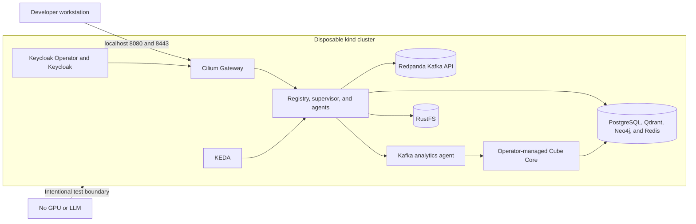

# Disposable kind environment

This Terraform root creates a local kind cluster with the default CNI and
kube-proxy disabled, then installs Gateway API, Cilium/Envoy/Hubble, KEDA, the
official Keycloak Operator, Redpanda's Kafka-compatible broker, RustFS, and the
platform chart. PostgreSQL, Qdrant, Neo4j, Redis, the registry, supervisor,
weather agent, graph API/UI, and operator-managed Keycloak run in-cluster.

Local credentials are fixed and development-only. The environment has no Linux
GPU or in-cluster model server. On Apple Silicon it can use an MLX server on the
macOS host for agent routing; otherwise it verifies control-plane, identity,
persistence, networking, Kafka, and lightweight agent paths—not GPU inference
or graph-extraction quality.

## Prerequisites

Start Docker Desktop and install Terraform, kind, kubectl, and Helm. On macOS:

```bash
brew install terraform kind kubectl helm
docker info
```

`docker info` must succeed before `terraform apply`.



```bash
terraform init
terraform apply
kubectl --context kind-agentic-platform get pods,gateway,httproute -A
curl http://127.0.0.1:8080/knowledge/health
```

Install and verify the sibling open-source Cube operator and BI showcase:

```bash
cd ../..
./scripts/install-cube-analytics.sh
./scripts/verify-cube-analytics.sh
```

This supports amd64 and Apple Silicon Kind nodes. Cube and Cube Store remain
private behind the Kafka-routed analytics specialist.

### Apple Silicon MLX gateway

The kind profile points the supervisor at `host.docker.internal:8081`. On an
Apple Silicon Mac with at least 20 GiB free disk, start the pinned 4-bit model
on macOS—not inside kind—so MLX can access Metal:

```bash
python3.12 -m venv .venv-mlx
.venv-mlx/bin/pip install -U mlx-lm
MLX_SERVER=.venv-mlx/bin/mlx_lm.server bash scripts/run-mlx-gateway.sh
curl http://127.0.0.1:8081/health
```

Open `http://127.0.0.1:8080/dashboard` and choose **Auto · LLM router** for
model-selected agent routing. Selecting a named skill continues to work while
the MLX server is stopped. `mlx_lm.server` is suitable for local development,
not production exposure.

The Cilium Gateway binds host-network ports mapped to loopback 8080/8443. Run
`terraform destroy` to delete the entire cluster.
