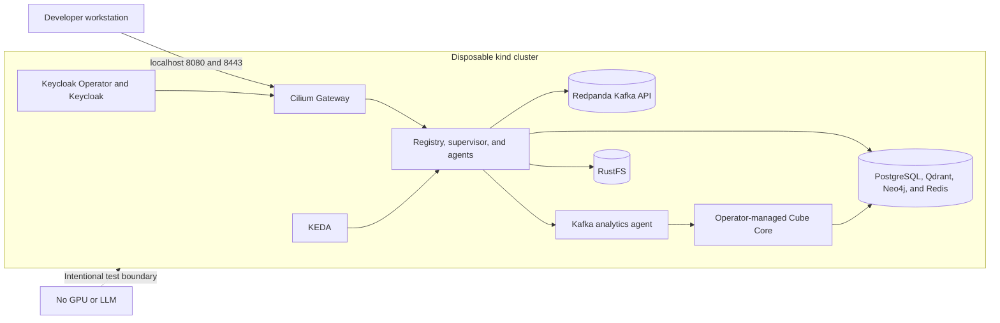

# Disposable kind environment

This Terraform root creates a local kind cluster with the default CNI and
kube-proxy disabled, then installs Gateway API, Cilium/Envoy/Hubble, KEDA, the
official Keycloak Operator, Redpanda's Kafka-compatible broker, RustFS, and the
platform chart. PostgreSQL, Qdrant, Neo4j, Redis, the registry, supervisor,
weather agent, graph API/UI, and operator-managed Keycloak run in-cluster.

Local credentials are fixed and development-only. The environment has no Linux
GPU or in-cluster model server. On Apple Silicon it can use two MLX servers on
the macOS host for text routing/extraction and vision; otherwise it verifies control-plane, identity,
persistence, networking, Kafka, and lightweight agent paths—not GPU inference
or graph-extraction quality.

## Prerequisites

Start Docker Desktop and install Terraform, kind, kubectl, and Helm. On macOS:

```bash
brew install terraform kind kubectl helm
docker info
```

`docker info` must succeed before `terraform apply`.



```bash
terraform init
terraform apply
kubectl --context kind-agentic-platform get pods,gateway,httproute -A
curl http://127.0.0.1:8080/knowledge/health
```

Install and verify the sibling open-source Cube operator and BI showcase:

```bash
cd ../..
./scripts/install-cube-analytics.sh
./scripts/verify-cube-analytics.sh
```

This supports amd64 and Apple Silicon Kind nodes. Cube and Cube Store remain
private behind the Kafka-routed analytics specialist.

Install Prometheus, the pre-provisioned platform/Cube Grafana dashboard, and its
Cilium route:

```bash
./scripts/install-monitoring.sh
open http://127.0.0.1:8080/grafana/
```

After Cube is installed, reapply/upgrade the platform with both
`values-kind.yaml` and `values-cube-kind.yaml`. The Terraform bootstrap detects
the existing CubeCluster and does this automatically.

### Apple Silicon MLX text and vision bridge

The kind profile points text routing and extraction at
`host.docker.internal:8081` and vision at port 8082. Run both on macOS—not
inside Kind—so MLX can access Metal:

```bash
python3.12 -m venv .venv-mlx
.venv-mlx/bin/pip install -U mlx-lm mlx-vlm
# Terminal 1
MLX_SERVER=.venv-mlx/bin/mlx_lm.server bash scripts/run-mlx-gateway.sh
# Terminal 2
bash scripts/run-mlx-vision.sh
curl --fail http://127.0.0.1:8081/v1/models
curl --fail http://127.0.0.1:8082/v1/models
```

Open `http://127.0.0.1:8080/dashboard` and choose **Auto · LLM router** for
model-selected agent routing. Selecting a named skill continues to work while
the MLX server is stopped. `mlx_lm.server` is suitable for local development,
not production exposure.

Qwen3.8 uses about 16.1 GB of model weights and Qwen3-VL about 3.1 GB. A 48 GB
Mac is workable with headroom, but Docker, context/KV caches, and the desktop
share unified memory. See the root
[MLX bridge guide](../../README.md#apple-silicon-mlx-local-gpu-bridge).

The Cilium Gateway binds host-network ports mapped to loopback 8080/8443. Run
`terraform destroy` to delete the entire cluster.
